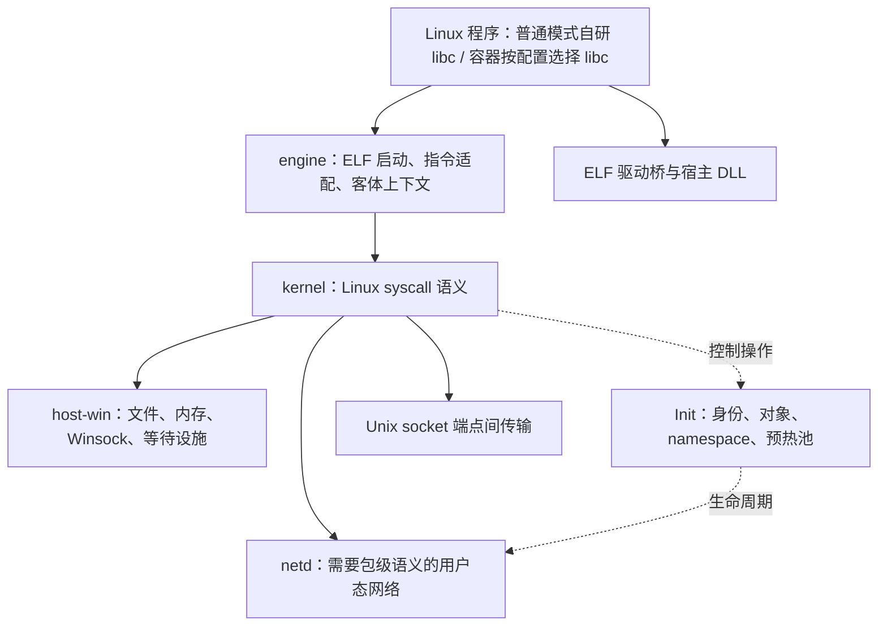

# Kinakaze V2 最终架构与完整实现方案

版本：2.0 · 日期：2026-09-09 · 源码调查基线：`28cfe05`

本文统一进程、内存、I/O、网络、自研 libc 与完整 Linux 用户态语义的设计。各功能给出状态归属、实现机制和验证路径，缺失功能不能以返回错误代替。本文是设计文档，尚未实施的机制与已验证的当前代码分开看待。

阅读顺序：第 1–3 节定义目标和归属，第 4–7 节定义 syscall、自研 libc 与设备桥，第 8–15 节定义进程和基础内存，第 16–28 节定义 I/O、通信和基础语义，第 29–35 节补全调度、分页、IPC、文件扩展、安全、调试与设备，第 36 节定义 ABI 覆盖账本，第 37–38 节定义实施和验收。每项规则只由所属章节定义，其他章节引用它。

## 1. 设计目标、运行模式与完整性要求

Kinakaze V2 面向 Windows 上的 Linux x86-64 程序与容器，目标是同时解决完整兼容语义、普通程序性能和现有状态管理复杂度。部署约束保持为**无管理员权限、无自装驱动**；Init、worker、netd 和设备 provider 均为当前用户启动的普通 Windows 进程。

进程模型固定为**一个活动 worker 对应一个 Linux 进程**，进程的 Linux 线程在该 worker 内执行。共享 mm 不合并进程；跨 worker 共享与 exec 交接见第 10–14 节。

| 运行模式 | libc 选择 | 加载与加速方式 |
| --- | --- | --- |
| 普通运行模式 | **必选项目自研 libc**，作为发行包的核心依赖 | 项目 ELF 运行时及自研 libc 提供 GNU/Linux C ABI，Windows 后端提供加速 |
| 容器原生模式 | 使用镜像自带 glibc/musl、ld.so、pthread | 原始 syscall 进入同一 kernel，不修改镜像中的 libc |
| 容器自研 libc 模式 | 用户可以选择项目自研 libc | 以完整、相互匹配的运行时视图只读挂载，不混装两套 libc/TLS/线程运行时 |

普通模式中的静态 ELF 已经包含自己的 C 运行时，无需也不能靠注入把静态函数改成另一套 ABI；它仍由完整的 Kinakaze 发行运行时启动，执行同一 syscall 契约。自研 libc 的必选地位不等于强行重写既有静态机器码。

**缺少宿主 API 时必须提供 Linux 语义实现。** Windows 原生机制用于加速，用户态内核对象、受管理内存、协议栈和虚拟设备负责补足语义。ENOSYS/EOPNOTSUPP 不能作为尚未设计或实现的目标功能的交付方案；正常的参数错误、权限拒绝、资源耗尽、设备故障，以及目标 Linux 本来保留的无实现编号，仍按真实 ABI 表达。

“完整”以第 36 节的版本化接口账本验收，覆盖 syscall、子命令、flags、ioctl、socket option、文件系统类型和 libc 符号版本。本文给出实现方案，不把设计完成等同于实现或测试完成。宿主物理资源与客体虚拟资源的关系由第 35 节明确，不能用虚拟实现冒充取得了额外 Windows 权限。

## 2. 总体分层与代码依赖

系统由执行引擎、Linux 语义层、Windows 后端和 Init 控制面组成。常规数据操作在调用 worker 或其对象后端完成，Init 处理身份、配置及资源生命周期。



建议的逻辑模块如下；可以按编译需求组合 crate，不为每种对象单独建立 crate。

| 模块 | 唯一职责 |
| --- | --- |
| `kinakaze-abi` | Linux UAPI 布局、编号、错误和共享 ABI 类型 |
| `kinakaze-kernel` | process、fd、fs、net、ipc、signal 等 Linux 语义 |
| `kinakaze-engine` | ELF bootstrap、GuestContext、TLS、patch、JIT/AOT |
| `kinakaze-host-win` | Windows HANDLE、VM、I/O、AFD、Job 等机制封装 |
| `kinakaze-protocol` | 控制消息、对象标识、共享布局和协议版本 |
| `kinakaze-init` | 组装控制对象、进程监督、资源回收与预热池 |
| `elf-loader / worker` | 组装 engine、kernel 和 host-win，承载一个 Linux 进程及其线程 |
| `netd` | 网络数据平面角色，可由同一宿主程序的独立启动模式提供 |
| `libs/libc` | 普通模式必选的 GNU/Linux C ABI、标准库与线程运行时 |
| 驱动桥 | 设备互操作 ABI，与 libc 共享 kernel 服务但不混入 libc 状态 |

kernel 不反向依赖 libc、loader 或 Init 可执行文件。engine 经固定 syscall gate 调用 kernel；kernel 经窄的客体内存及上下文接口访问 engine，由 worker 完成依赖注入。Windows 结构与未公开 API 细节只出现在 host-win。

## 3. 对象模型与状态归属

共享、复制和销毁均围绕有类型的对象执行，避免一个全局 ProcessState 或通用字节存储承担全部职责。

| 对象 | 内容 | 权威状态所在位置 |
| --- | --- | --- |
| `Process` | Linux 线程组身份、父子关系、进程组、会话、退出状态、活动 worker 绑定与执行代次 | Init |
| `Task` | 客体线程、寄存器、TLS、信号 mask 和上下文引用 | 执行该 Task 的 worker；身份注册在 Init |
| `AddressSpace` | 客体 VMA、brk、映射代次、成员和页内容 | 单 worker 时本地；共享后元数据由 Init 的 mm 协调器发布，页内容在共享 section，worker 持本地视图 |
| `Files` | fd 到 OFD 的关联、fd flags、slot generation | 单 worker 时本地；跨 worker 共享时使用同一 Files 对象的共享表示 |
| `OpenDescription` | 文件位置、status flags、端点状态和后端资源引用 | 对象状态；共享后不得保留多个可独立修改的副本 |
| `FsContext` | root、cwd、umask | 可共享的内核对象 |
| `NsSet / Credentials` | namespace 和凭据对象引用 | Init 管对象与版本，Task 持当前引用 |
| `Image` | ELF 内容身份、解释器与代码适配计划 | 不变内容由 image cache 管理，实例映射属于 AddressSpace |
| `Scheduler / Pager` | Task 运行资格、页身份与 charge；模块内各有唯一 owner | 调度服务与分页器，worker 持可验证的本地执行状态 |
| `Policy / Program` | 凭据策略、过滤程序、attachment 与版本 | 内核安全对象，执行入口按代次读取 |
| `Device / Provider` | 虚拟设备能力、命令队列与宿主设备引用 | DeviceObject 管语义，provider 管宿主对象 |
| `HostState` | HANDLE、IOCP、OVERLAPPED、Rust 堆/锁、PE DLL TLS | 当前宿主进程，不能作为客体快照复制 |

对象共享和状态同步使用同一套发布规则：固定布局、明确内存序、带代次的标识和受持有引用保护的版本。独占对象转为跨 worker 共享时，先停止该对象的变更、发布完整状态，再建立接收方引用；不得让旧本地副本继续成为第二个写入源。

跨进程可见的标识为 `InitEpoch + ObjectId + Generation`。本地缓存保存对象引用和版本，不取得第二份权威状态。宿主绝对指针、Rust 容器及函数地址不进入共享协议；客体地址携带所属 AddressSpace，不能当作另一 worker 的宿主地址使用。

## 4. Syscall 入口与客体内存访问

Linux syscall 是统一语义边界。raw 入口解码编号及参数，调用有类型的内核操作，返回 Linux 负 errno；自研 libc 负责 C ABI 返回值和线程 errno。kernel 不加载或调用 libc 内部实现。

```text
raw syscall / 自研 libc fast gate
    -> 统一编号、参数和 Task 上下文
    -> seccomp / ptrace / 权限与资源策略
    -> Linux 内核操作
    -> 原生加速后端 或 等价用户态实现
    -> 统一完成、信号重启、审计与返回值
```

libc 的文件、网络和进程加速入口保留对应的逻辑 syscall 身份，进入相同的策略与观察点；不能绕过 seccomp、strace、cgroup、文件权限或 namespace。字符串、解析和缓冲等纯用户态函数不需要伪造 syscall。

建立 GuestPtr/GuestSlice 接口，统一地址溢出、长度上限、权限、跨页访问和 EFAULT。禁止仅检查非空就构造任意 Rust 引用。输入按操作契约复制或固定；输出和映射生命周期协调。copy-in/copy-out 的失败、部分复制、重入与异步写回均走同一接口。缺页处理由第 30 节提供，异步缓冲由第 18 节管理。

每次调用从 Task 获取 Files、FsContext、凭据和 namespace。Windows 全局 cwd、环境变量、宿主 PID 和 CRT errno 不能表示客体状态。进入客体回调前释放宿主及内核锁；客体长跳转、异常、取消不能穿越活动的 Rust 栈帧。

分发器按第 36 节账本生成：每个操作必须有参数布局、owner、主后端、通用后端和测试引用。缺少条目导致构建或发布检查失败，不能自动生成返回成功或返回“不支持”的占位处理器。

## 5. ELF 启动与动态链接

静态 ELF 由 engine 映射并进入入口。动态 ELF 按运行模式选择匹配的解释器：普通模式进入项目运行时的 ELF ld.so，容器原生模式进入 PT_INTERP 指定的镜像解释器；均构造真实 Linux stack/auxv。普通模式通过运行时挂载视图解析解释器和依赖，保持原程序文件不变。

动态链接器承担 DT_NEEDED、RPATH/RUNPATH、symbol versioning、weak/strong 与 GNU unique 符号、IFUNC、COPY relocation、TLS module ID/DTV、lazy/eager binding、RELRO、dlopen/dlclose/dlmopen 和审计接口。项目维护与自研 libc 配套的 ld.so，复用现有 ELF 工具链；不能用 PE LoadLibrary 替代这些 ELF 规则。

普通模式的自研 libc 暴露标准 ELF 符号和数据对象，宿主 PE 实现通过受控入口表绑定。解释器、libc、libpthread/libdl/librt 兼容入口和启动文件必须按一套 ABI 发行；GLIBC_PRIVATE 仅在明确匹配的内部组件之间使用。容器原生模式的链接器自行管理内部状态，kernel 只提供 Linux 映射和启动契约。

运行中新建执行映射经过 engine。装载锁按 Task 重入规则管理，构造/析构和 TLS destructor 在正确 guest 上下文运行；持有内部可重入状态时不等待 Init 的其他回调。exec 在提交前不执行新映像指令，第 14 节统一定义切换。

既有 ELF parser、映射验证和指令分析可以复用。验证包括静态 PIE、多个 DSO 的 TLS、版本化数据符号、IFUNC、dlmopen 命名空间、dlclose 后回调和 C++ 异常展开；只验证符号可找到不足以说明 ABI 兼容。

## 6. 自研 libc 核心模块与 GNU ABI

这里的 libc 指项目现有自研实现。它在普通运行模式中必选，与 kernel、engine 同为核心模块；在容器中由运行配置选择。syscall 优先决定语义边界，libc 的核心地位决定 C/GNU ABI、标准库、线程运行时与宿主加速的完整交付，两者分别承担自己的职责。

### 6.1 模块组成与发行契约

自研 libc 按 abi、startup、allocator、stdio、string、locale、math、pthread、resolver、dynamic、process 和 extensions 分层；可以组合 crate，但不允许重新形成跨模块全局 ProcessState。普通模式一并提供 ELF libc.so.6、配套解释器、crt 启动文件、headers、静态库、符号版本表及调试信息；libm、libpthread、libdl、librt、libresolv 的入口统一指向配套实现。

现有实现为 Windows cdylib，可继续作为宿主实现载体；面向 ELF 的函数封装与数据定义由 ABI 描述生成。函数 trampoline、数据符号、TLS 符号分别生成，不能把 stdin、environ、optind 等数据当函数转发。可继承的 FILE、errno、allocator 元数据、pthread 对象和 locale 状态位于 guest 可继承存储，HostState 仅保存可重建的本地后端。

GNU ABI 清单逐版本记录符号类型、大小、默认版本和历史版本，覆盖 GLIBC_*、`__libc_start_main`、`__errno_location`、`__tls_get_addr`、`__cxa_atexit`、`__cxa_thread_atexit_impl` 等链接与运行入口。公开结构的布局及程序实际引用的 GNU 扩展逐项对照；不把“同名”视为“同 ABI”。C++ 的 libstdc++/libgcc_s 属于独立依赖，但其 TLS、异常展开、线程析构和 allocator 边界纳入联调。

### 6.2 纯用户态标准库与数据服务

| 功能族 | 完整实现路径 | 关键验证 |
| --- | --- | --- |
| 字符串、内存、搜索排序 | scalar 语义实现作为基线，按 CPU 能力选择 SIMD；包含 GNU string、argz/envz、obstack、search 接口 | 重叠、边界页、对齐、零长度、比较符号、回调重入 |
| printf/scanf、数字转换 | 统一解析器、SysV va_list、位置参数、long double、宽字符和 locale 转换；各入口复用状态机 | 舍入、溢出、截断、%n、EOF 与输入失败区别 |
| wchar、locale、iconv、gettext | Linux wchar_t/mbstate_t 布局，版本化 Unicode/locale 与字符集转换数据，线程 locale，消息目录解析 | 中文/组合字符、非法序列、增量转换、跨线程 locale、collation |
| 数学、复数与 fenv | libm 提供逐函数算法、x87/MXCSR 环境与 GNU 扩展；硬件指令不足时软件计算 | 舍入模式、异常标志、signed zero、NaN、subnormal、误差范围 |
| regex、glob、fnmatch、wordexp | 解析与执行引擎使用客体 locale；文件展开走 VFS，命令替换走受控进程创建 | GNU/POSIX 方言、回溯边界、转义、错误位置与资源上限 |
| getopt/argp、环境与配置 | 可重入解析器及兼容全局变量；环境快照属于 Process，sysconf/pathconf 从对应对象读真实配置 | 并发、exec 继承、配置变更和 GNU 行为 |
| 随机、加密相关入口 | getrandom 走统一内核随机源；库级 PRNG 保留规定状态，密码散列使用匹配格式的独立实现 | fork 后状态、种子规则、重入、已知向量 |

GNU 功能目录用于 ABI 清单来源，具体后端与分层是本项目设计。[GNU C Library 功能目录](https://sourceware.org/glibc/manual/latest/html_node/index.html)

### 6.3 Allocator 与 stdio

allocator 复用既有 guest allocator 分离，采用线程缓存、小对象 size class、共享 arena 和大对象 VMA。线程缓存按 Task 生命周期回收；malloc/realloc/calloc/aligned_alloc/posix_memalign、溢出与对齐、malloc_usable_size 和诊断接口使用同一元数据。fork 准备阶段稳定 arena 与缓存，子进程重建本地等待设施，不能复制宿主 CRT 锁。统计与 cgroup 计费分别属于 allocator 与第 27 节，不能混用。

stdio 的 FILE 布局、读写指针、orientation、锁和缓冲属于 guest。实现 fread/fwrite 的短 I/O、ungetc、fseek/ftell、setvbuf、fflush、flockfile、fmemopen/open_memstream、fopencookie、宽字符流和 GNU 扩展。读写切换、seek 与缓冲同步由一个流状态机处理；底层 fd 始终进入第 17–18 节。fopencookie 回调释放 host guard 后进入 guest，不能把 callback 指针直接当 Win64 函数调用。

fork 前 libc 按其约定锁定并整理自身对象；父子回调分开恢复。普通 raw fork 保持 Linux 规则，不自动替客体运行 libc 的 pthread_atfork。

### 6.4 pthread、TLS、取消与异常边界

pthread_create 使用 CLONE_THREAD 在当前 worker 建立 Task，管理 stack/guard、TLS、DTV、thread-specific data 和 destructor 迭代。join/detach、返回值、线程退出、once、barrier、rwlock、condvar、spinlock、mutex 的 normal/recursive/errorcheck/robust/PI/priority-ceiling/pshared 属性逐项实现。等待算法基于第 23 节；调度属性基于第 29 节，不把所有类型压成一个 SRWLOCK。

mutex 无竞争路径使用客体原子操作；竞争、owner death 和 PI 路径进入 futex 对象。condvar 使用序列和等待队列协调 unlock/wait/relock，包含取消后重新取得互斥锁、广播、时钟选择和超时竞态。once 初始化者取消时恢复可重试状态；barrier 按代次释放；rwlock 明确读写者队列与实现所声明的公平性。

deferred cancellation 在规定的 cancellation point 提交。async cancellation 由 engine 在可恢复的客体指令边界交付，先退出宿主临界区、处理在途请求，再运行 cleanup 和线程析构；不能对任意 Rust/CRT 栈强行 longjmp。setjmp/sigsetjmp、longjmp/siglongjmp 保存客体 ABI 上下文及相应 mask，C++ forced unwind 经 guest 展开器运行。动态链接器持锁、分配器关键区和 provider 回调均纳入安全阶段协议。

### 6.5 进程、文件、网络与 NSS

fork/exec/wait、posix_spawn 的 file actions、signal attributes、进程组和调度属性调用统一 kernel。posix_spawn 使用明确的创建描述直接构建子进程，不能根据普通 fork 的历史行为推测后续 exec。文件、目录、xattr、stat、socket、poll、terminal、SysV/POSIX IPC 等包装都复用对应章节；内部 fast gate 保留相同策略与可观察事件。

getaddrinfo/getnameinfo、res_*、用户/组/服务数据库按客体 nsswitch.conf、resolv.conf、hosts、search、排序、IPv4/6、超时与缓存规则执行。DNS 走当前网络 namespace；Windows 名称服务仅在能证明配置及语义一致时作为后端。NSS/gconv 扩展以匹配 ELF ABI 的插件运行，回调、线程安全与生命周期按动态链接规则管理，不能直接装入未知 PE 插件。

### 6.6 加速与兼容验收

每个性能优化保留同一语义实现作为参照：SIMD、批量 stdio、arena 缓存、vDSO、DNS 缓存、直接 kernel gate 和生成的 ABI bridge 均测量真实应用收益。启动加速不省略初始化、符号版本或线程清理。

发行门禁包含 GNU 符号版本与布局检查、库级边界用例、Linux 差分、glibc 测试中适用的公共 ABI 用例、动态链接和 C++/Java/Python/Go/Nginx 联调。容器原生、自研 libc 普通模式、自研 libc 容器模式分别验收，不能用其中一种通过代替另一种。

## 7. Vulkan 与宿主设备互操作

Vulkan、OpenGL、显示、音频等桥独立于 libc 的内核语义。客体加载有效 ELF 驱动桥，再调用 Windows provider；Vulkan 使用 ICD manifest 与标准 loader 接口，不能把 PE 改名为 .so。[Khronos 驱动接口](https://github.com/KhronosGroup/Vulkan-Loader/blob/main/docs/LoaderDriverInterface.md)

桥按 vk.xml 等接口描述生成 SysV/Win64 封送、结构/扩展链、callback、错误与生命周期代码。动态 dispatchable handle 是客体对象，内部引用带代次的 provider 对象；可继承数据不保存裸 Windows 驱动指针。

| 对象或操作 | 实现机制 |
| --- | --- |
| 宿主驱动上下文 | 由独立的普通 Windows provider 进程持有，使 worker fork/exec 不需要复制驱动内部线程与锁 |
| 高频命令录制与提交 | 客体保存可验证的命令描述，经共享队列批量提交；同步返回值和依赖关系按 API 保留 |
| map/flush/invalidate、外部内存 | 能导出兼容共享内存时建立 section 引用；其他情况使用受跟踪 staging 与同步操作完成数据转移 |
| fence/semaphore 与回调 | provider completion 更新稳定对象，客体等待走 ReadySource，回调回到所属 Task 的 guest 入口 |
| WSI、窗口、显示与输入 | display provider 管宿主窗口，客体对象管 X11/Wayland/WSI 身份与事件，事件经队列进入程序 |
| 音频 | 环形 PCM 缓冲、时间戳与设备时钟映射到宿主音频 API，pause/drain/underrun/重连保留状态 |
| fork 与 exec | 按 provider 对象的 API 继承契约移交引用，host 驱动继续由 provider 持有；exec 释放本进程的旧引用 |

共享内存不等于所有 Vulkan memory property 自动等价：coherent、device-local、外部 handle 和 dma-buf 的每种能力必须有实际数据与同步路径；缺少硬件功能时选择实现该能力的软件设备/渲染后端，不能只公布扩展名。软件后端与硬件后端使用同一桥协议，其能力与性能分别公布。

API 自身禁止的使用方式，例如缺少外部同步的并发访问，仍按 API 契约处理。设计需要完成的是有效调用序列的后端实现；不是为复制未知驱动内存赋予正确性。provider 退出后按设备丢失契约终结请求、回收对象，重新创建设备通过新代次执行。

## 8. Init 的启动与故障模型

每个独立运行环境一个 Init。Init 管 Process 身份、控制对象、worker、netd 和预热池；不执行客体代码或常规 I/O payload。容器自身的 PID 1、subreaper 和 namespace 生命周期保持 Linux 语义。

Init 先采用一个控制事件循环配合少量后台任务。named pipe + Overlapped I/O 提供本地控制通道，支持批量请求和版本协商；首个入口负责启动 Init，后续入口加入经身份验证的同一实例。不同协议版本不得误接入。

进程死亡以持有的真实进程 HANDLE 和执行代次判定。Job 通知作为辅助，不能假设普通通知逐条可靠。Init 独持且不向 worker 继承根 Job 的 KILL_ON_JOB_CLOSE 句柄，使其异常退出后整个运行环境终止。[Job Objects](https://learn.microsoft.com/en-us/windows/win32/procthread/job-objects)

Init 采用明确的 fail-stop 故障模型：异常死亡时根 Job 终止活动环境，启动新 Init 后恢复持久文件与配置，再重新启动应用。待决事务按日志与对象代次回收；不可持久化的活动执行、socket 和 GPU 状态随该次环境结束，不能用旧句柄重新接入。服务自身的故障恢复规则分别由其章节定义，避免所有后端独立发明恢复协议。

## 9. 跨进程资源移交与回收

所有跨 worker 引用使用同一控制协议；fork、exec、SCM_RIGHTS 等只定义各自的对象集合及可见性边界。

```text
Reserve(request_id) -> Prepared -> Adopted -> Committed
                          |           |
                          +-----------> Aborted
```

Prepared 固定源对象与目标身份；Adopted 表示接收方已建立本地后端引用；Committed 才允许操作对客体可见。request_id 支持查询和幂等重试。提交前失败撤销本事务引用；提交后退出走正常生命周期，不能再次回滚已对外可见的操作。

普通句柄按类型使用 DuplicateHandle，Winsock 使用 WSADuplicateSocketW/WSASocketW。传输中保留源引用和目标进程 HANDLE；目标用本地容器登记取得的句柄。禁止根据过期远程句柄数值清理，因为它可能已被其他对象复用。[Winsock 复制接口](https://learn.microsoft.com/en-us/windows/win32/api/winsock2/nf-winsock2-wsaduplicatesocketw)

Init 的对象目录记录引用属于 Files、队列还是在途事务。worker 死亡后按所有权回收，其他存活者持有的引用保留；异步请求终结后才释放它所持的资源。跨进程原子引用计数不能单独承担死亡恢复。

共享状态由可恢复锁和提交记录保护。abandoned mutex 后按对象协议修复或返回失败，不能仅强行解锁继续使用。Unix fd 传递形成的引用环采用以存活 Files、在途 I/O 和资源事务为根的可达性回收，避免仅引用计数造成泄漏。

## 10. Worker 与 Linux 任务映射

**一个活动 Windows worker 只承载一个 Linux Process，一个运行中的 Process 只绑定一个有权执行客体指令的 worker。** Process 表示 Linux 线程组；Task 表示其中的线程，基线映射为该 worker 内的 Windows 执行线程。宿主控制和 I/O 辅助线程不创建 Linux TID，Linux PID/TID 与 Windows PID/TID 分开。

| 关系 | 固定规则 |
| --- | --- |
| Worker ↔ Process | 活动执行绑定一一对应，进程间各有独立的 HostState |
| Process → Task | 一个进程可以包含多个线程，均在其 worker 内执行 |
| Process → AddressSpace | 当前映像引用一个 mm；不同进程可以按 clone flags 共享同一 mm |
| Process → Windows 身份 | Linux 身份由 Init 管理，宿主执行身份带代次，可在 exec 提交时交接 |

CLONE_VM 不合并 worker：不同线程组仍使用不同 Windows 进程，经第 12 节共享 AddressSpace。Files、FsContext、signal disposition 和 namespace 是否共享由各自的 Linux 规则决定，不能从进程或 mm 的相同与否推断。[clone(2)](https://man7.org/linux/man-pages/man2/clone.2.html)

预热 worker 尚未绑定可运行的 Linux 进程；exec 候选 worker 在提交前没有客体执行权。僵尸 Process 可以仅保留在 Init 中供 wait 回收。以上生命周期状态不允许一个 worker 同时运行多个 Linux 进程，也不允许新旧 worker 同时执行同一个 Process。

此模型使进程终止、宿主故障定位和 Job 成员映射以单个 Linux 进程为单位；共享 mm 内容仍可能受其他共享者影响。代价是跨进程 CLONE_VM 必须协调内存内容和映射拓扑，相关复杂度集中在 AddressSpace 后端。

逻辑父子关系、waitpid、pidfd、kill、进程组与会话定位 Process/Task 对象。getpid 可以使用稳定身份缓存；getppid 等可变关系必须读取有版本的状态，收养后不得返回旧父身份。

## 11. 预热进程池

预热池准备尚未运行客体的 worker：核心宿主运行时、异常入口、host stack/TLS、控制通道、API 能力查询和客体地址预留已完成。ELF 分析缓存可共享，应用构造函数、连接和设备对象不提前运行或建立。

```text
Starting -> Ready -> Claimed -> Mapping -> GuestRunning -> Retired
               |        |          |
               +--------+-----------> Failed -> Exit
```

worker 单次使用，领取后只服务一个 Process 的一个执行代次，退出后不清洗回池。池按 runtime ABI、可兼容地址布局和环境根 Job 选择；动态 cgroup 使用第 27 节的语义控制器，避免把可迁移的客体成员固定到不可迁出的 leaf Job。[Nested Jobs](https://learn.microsoft.com/en-us/windows/win32/procthread/nested-jobs)

从小容量开始，根据命中率、补货速率和空闲 commit 调整，不固定承诺 4–8 个或 8TiB。池耗尽时按资源预算创建新 worker 或返回明确错误，不无限等待。

池化移走的是 Windows 进程创建和宿主初始化。完整启动、fork、exec 仍按后续章节执行其语义步骤，池获取耗时不作为这些操作的总耗时。

## 12. 客体内存与快照后端

客体 VMA 包含 ELF 数据、guest heap、brk、mmap、stack 和 guest TLS。HostState 使用独立存储；现有 guest allocator 分离可以复用，但 fork 不再依赖复制 loader 的 Rust arena 或 PE 指针。

启动时预留必要客体地址区间并验证宿主映像冲突。fork 和跨 worker 共享 mm 保持真实客体地址，exec 可重新布局；不能任意重定位客体指针。VMA backend 统一实现 map、局部 unmap、protect、split、merge 和失败恢复。

VirtualAlloc2 placeholder 配合 MapViewOfFile3 的 MEM_REPLACE_PLACEHOLDER 可用于页粒度替换；它要求视图与 placeholder 精确匹配，且不支持 SEC_IMAGE 替换。普通映射的 64KiB 对齐要求不能直接套成 Linux 页规则。[MapViewOfFile3](https://learn.microsoft.com/en-us/windows/win32/api/memoryapi/nf-memoryapi-mapviewoffile3)

| 内存种类 | 新建独立 mm 时的基线处理 |
| --- | --- |
| 不变 ELF 内容、已验证代码块 | 引用只读 backing |
| MAP_SHARED | 保持同一 backing 和共享可见性 |
| 单 worker mm 中可首次冻结的私有匿名 section | 复用现有冻结与 COW view 机制 |
| 已产生私有页的 COW mapping | 原 backing 加全部私有修改；不确定页保守复制 |
| 普通私有提交页、客体 stack | 按连续区间复制到新 backing，保留权限 |
| 多 worker 共享 mm 中的私有可写 VMA | 冻结全部共享者，对当前内容建立独立副本；不能向仍可被其他 mm 修改的 backing 建立 COW view 冒充快照 |
| 未提交、guard、DONTFORK、WIPEONFORK | 分别保留状态、省略或清零 |

COW view 的私有修改不会写回原 backing，新建 view 不能自动继承这些修改；整个 view 还可能预收 commit。不得把非驻留页视为干净，或仅根据 RSS 认定快照成本很低。[MapViewOfFile](https://learn.microsoft.com/en-us/windows/win32/api/memoryapi/nf-memoryapi-mapviewoffile)

AddressSpace 分为独占和跨 worker 共享两种后端。首次跨进程 CLONE_VM 时，在停驻与映射屏障内把现有私有内容（包括 COW 脏页）物化为该 mm 专用的可共享 backing，各 worker 在相同客体地址映射同一 section，并保留 Linux VMA 属性。MAP_PRIVATE 仍相对于其他 mm 及原文件保持私有，同一 mm 内的写入则对全部成员可见；只读区域后续变为可写时也必须遵循这一归属。各 worker 分别建立 FILE_MAP_COPY 视图无法满足此规则。

共享 mm 的成员和 VMA 事务由 Init 内按 AddressSpaceId 分组的协调器串行处理。mmap、munmap、mprotect、brk、mremap 及改变页内容归属的操作，按“预备资源、停驻全部成员及相关后端访问、应用本地映射、全部确认、发布代次、恢复执行”执行；待加入的 worker 在拿到已提交布局前不能执行客体。普通 load/store 直接访问 section，不经过 Init 或远程读写 RPC。

事务保留恢复所需的旧 backing 和布局，提交前失败恢复旧状态；若某成员无法恢复，确认其终止并移除成员后，才允许其余成员在一致布局上恢复。首次共享还要交接既有 futex 等待者和代码缓存失效订阅，具体规则见第 23、28 节。第一版不因成员暂时降至一个就反复切回独占表示，减少状态切换。

共享 mm 再执行普通 fork 时，基线复制私有可写内容到新的 mm，真正的 MAP_SHARED 保持共享；单 worker 的 Windows COW 优化不能直接推广为多个共享者之间的自动 COW。首次共享的物化成本、映射广播和该路径的复制成本分别计量，不能声称 vfork 或普通 fork 恒定耗时。跨 worker 软件 COW 可作为后续实验，不是基础正确性的前提。

后续可实验分块不可变快照代次、脏区间合并和批量映射，衡量扫描、复制、VAD 数量与重映射成本。PSS VA clone 和 Native 进程克隆只作为独立实验；PSS 的公开快照契约不足以证明子进程能够正常继续执行 Win32 运行时。[PssCaptureSnapshot](https://learn.microsoft.com/en-us/windows/win32/api/processsnapshot/nf-processsnapshot-psscapturesnapshot)

## 13. Fork、clone 与 vfork 创建流程

进程创建按 flags 选择对象共享关系，使用第 9 节移交协议和第 12 节内存后端，不调用模块自行注册的任意宿主快照回调。

| 操作 | 执行方式 |
| --- | --- |
| 合法的 CLONE_THREAD 组合 | 当前 worker 内创建 Task，保持同一 Process |
| CLONE_VM 且无 CLONE_THREAD | 新 worker、新 Process，加入同一 AddressSpace |
| vfork | 新 worker、新 Process，共享父 mm，调用的父线程等待规定的完成条件 |
| 普通 fork、不共享 VM 的合法 clone | 新 worker、新 Process、新 AddressSpace，恢复调用线程 |

先验证 flags 组合；CLONE_THREAD、CLONE_VM、CLONE_SIGHAND 等依赖保持 Linux 约束。CLONE_VFORK 的等待规则与是否共享 VM 分别处理，不能把所有带等待标志的 clone 都映射为共享 mm。

普通 fork 固定为以下步骤：

1. syscall 入口物化 GuestThreadContext；预留子身份、worker 和对象引用。
2. 停驻该 mm 在全部成员 worker 中的写入者，冻结 VMA 变更，并取得调用 Task 的一致 Files 关联快照。
3. 生成一次 MemoryImage、TaskImage 与 ObjectRefs；内存采用第 12 节分类处理。
4. 子 worker 建立映射及本地后端，重建自身 HostState，报告 Ready。
5. 提交子身份和引用，子上下文返回值设为 0，父返回子 Linux PID，然后解除冻结。

GuestThreadContext 定义 GPR、guest RIP/RSP/RFLAGS、所需 xstate、TLS base、signal mask 和 restart 信息。子进程从引擎恢复入口继续客体指令，不从父进程某个 Rust 栈帧中间继续。客体 libc 自行运行 pthread_atfork；raw fork 不额外触发 libc 回调。子进程只创建调用线程，其他线程的可继承内存仍属于快照。[fork(2)](https://man7.org/linux/man-pages/man2/fork.2.html)

冻结覆盖客体线程、syscall 输出写入和在途后端写入。线程按 Guest/Entry/Host/Return 阶段停驻；Host 临界区应完成或可控取消后再停驻，不能暂停锁持有者后等待同一把锁。持续执行客体循环的线程需要安全点或经过阶段/PC 检查的受控暂停，不能向任意指令位置注入 Rust 回调。

跨进程 CLONE_VM 先完成第 12 节的共享转换与子 worker 映射，再提交子身份并恢复执行。vfork 在此基础上只让调用父线程等待，其他线程在短暂映射屏障之后按 Linux 规则继续。子进程 exec 失败时仍可运行，父线程不能提前解除等待；成功 exec 并脱离旧 mm，或退出释放旧 mm 等规定条件才完成 rendezvous。普通 fork 不因“预计马上 exec”跳过快照。

## 14. Exec 映像替换

exec 保持逻辑 Process 身份，将它接入新 Image 和 AddressSpace。准备阶段验证路径、解释器、权限、参数和资源，取得预热候选 worker，并形成可启动映像；候选 worker 在 commit 前没有该 Process 的活动绑定，不执行新客体指令或构造函数。

提交前的可恢复错误返回旧映像。提交时按 Linux 规则处理 Files unshare、CLOEXEC、信号处置、线程终止、TLS 与旧异步上下文清理；确认旧代次不能再执行客体或向旧 mm 写入后，Init 原子切换活动绑定，再授予新 worker 执行权。旧 worker 的退出只回收旧执行代次，不能产生重复的 Linux 退出记录。[execve(2)](https://man7.org/linux/man-pages/man2/execve.2.html)

旧 worker 只承载此次 exec 的进程，交接后移除其旧 mm 成员及执行引用并退出。仍共享旧 mm 的其他 Linux 进程继续在各自 worker 中运行；vfork 父线程在子进程脱离旧 mm 后按第 13 节唤醒。父进程 wait 读取 Init 的逻辑退出记录，不需要旧 Windows 进程常驻作为等待包装器。

## 15. Namespace 与凭据

namespace 由有版本的对象及 Task 引用表达。setns/unshare 执行权限和共享约束检查，再切换引用或分叉对象。root/cwd 属于 FsContext；已有 fd、socket 等对象按各自规则保留创建时的归属。

| 类型 | 实现责任 |
| --- | --- |
| PID | 分层 PID 映射、PID 1、收养关系和 namespace 存续规则 |
| Mount | mount 树、bind、传播关系和 detach；路径行为见第 16 节 |
| Net | NetNsId、地址与拓扑；实际传输见第 21 节 |
| User | uid/gid map、setgroups、凭据与 capability 继承/转换；在客体对象上执行授权，详见第 33 节 |
| IPC | SysV IPC 与 POSIX MQ 的对象目录、额度及销毁；POSIX shm/sem 名称依其文件系统视图处理，见第 31 节 |
| UTS | 主机名、域名和对应可见性 |
| Cgroup | namespace root 与控制对象分离，路径/祖先可见性从当前引用解析，成员和限制见第 27 节 |
| Time | monotonic/boottime 偏移、创建/加入约束与后代继承由 TimeNamespace 管理，时钟换算见第 25 节 |

Windows Private Namespace 和 ACL 仅用于本运行环境的命名 section/event/mutex。使用当前登录范围、随机实例 ID 和正确 ACL，不依赖高权限全局映射。它不能代替 Linux namespace。[Object Namespaces](https://learn.microsoft.com/en-us/windows/win32/sync/object-namespaces)

不以 Windows network compartment API 作为 rootless net namespace 的既定实现；SetCurrentThreadCompartmentId 的官方页面明确标为保留、不要使用。[API 文档](https://learn.microsoft.com/en-us/windows/win32/api/netioapi/nf-netioapi-setcurrentthreadcompartmentid)

## 16. 文件路径、元数据与 Overlay

文件系统统一 inode/dentry、路径遍历和 mount 接口，分别提供 HostFS、受管理文件树、镜像 Overlay 和虚拟文件后端。普通文件内容仍使用 Windows 文件资源，Linux 特有名称和元数据由语义层表达。

路径从 dirfd 或 FsContext 逐段解析，处理 symlink、`..`、root 边界和 openat2 约束。缓存键含 mount 版本、目录身份和目录变更代次；权限结论还绑定凭据及元数据版本。HostFS 的外部变更必须触发失效或重查，不能只观察运行时自己的修改。

受管理文件树记录 inode、dentry、uid/gid/mode、xattr、symlink 和 whiteout，以内部文件身份保存内容，避免依赖宿主非法文件名或创建 symlink 的权限。目录大小写敏感可作后端能力优化，但要在标准用户和目标文件系统上探测，不作为 Linux 命名语义的唯一保证。[NtSetInformationFile](https://learn.microsoft.com/en-us/windows-hardware/drivers/ddi/ntifs/nf-ntifs-ntsetinformationfile)

Overlay 只读层使用不可变索引，可写层维护增量元数据。copy-up、rename、link、unlink 等变更由目录/文件对象事务协调，打开的 fd 继续引用原对象；常规内容 I/O 不经过 Init 的目录事务队列。

持久文件树采用版本化元数据和可恢复操作日志，明确数据变更、元数据发布及 fsync 的顺序。copy-up 或 rename 中途崩溃必须可回放或回滚；不假设宿主自动提供跨文件的原子事务。源于原生文件系统的 POSIX 删除能力按文件类型与卷能力选择，不能降低已承诺的打开文件生命周期语义。

共享文件映射、read/write、truncate 和 msync 由同一 FileObject 与页缓存协调。有可写映射的文件以共享缓存页作为内容源，普通读写更新或读取同一页；writeback 按脏代次刷回宿主文件，truncate 同步撤销越界页并处理后续 SIGBUS。没有映射且缓存不持脏数据时可直接执行宿主 I/O；路径切换先完成缓存交接与失效。Windows 不保证映射视图与 ReadFile/WriteFile 天然一致，因此原生加速必须满足上述缓存协议。[映射一致性说明](https://learn.microsoft.com/en-us/windows/win32/api/memoryapi/nf-memoryapi-mapviewoffile)

## 17. 文件描述符与 Open File Description

Files 的 fd slot 只保存 OFD 引用、fd flags 和 generation。dup、fork、SCM_RIGHTS 共享 OFD；普通 fork 复制 Files 的关联，CLONE_FILES 共享整个 Files。FD_CLOEXEC 属于 fd，文件位置与 O_APPEND/O_NONBLOCK 属于 OFD。[open(2)](https://man7.org/linux/man-pages/man2/open.2.html)

一次 I/O 固定对象引用后才执行；close 使 fd slot 失效，旧请求不会被重定向到复用后的 fd。跨 worker 使用共享 Files 时，本地缓存必须核对 slot generation 与有效版本。

普通 read/write 的位置更新按实际完成字节数推进，与 lseek 按 OFD 顺序协调。基线串行化同一 OFD 的位置操作，不持有全局 fd 锁等待 I/O；pread/pwrite 不占位置。不能提前 fetch_add 请求长度后忽略短读、取消或失败。

O_APPEND 在文件对象层按追加操作预留/提交实际区间，使用经验证的原生原子追加能力或有序请求执行器。跨 worker 的位置型 I/O 由稳定 I/O owner 管 offset 和 completion，payload 使用共享 buffer 引用，Init 不转发数据；调用 worker 死亡不会使实际完成字节数一同丢失。pread/pwrite 及不共享的位置路径仍可由调用 worker 直接执行。进程记录锁、OFD 锁、flock 和 lease 的详细算法见第 32 节。

fcntl 子命令按 fd flags、OFD flags、锁、租约、seals、pipe 容量、owner/异步通知等族登记，各自修改对应对象。close_range 处理 UNSHARE/CLOEXEC 的语义时先建立正确 Files 归属；pidfd_getfd 固定目标引用后再产生本地 fd。没有 Windows 等价选项的标志由内核对象执行，不能只缓存标志而不改变行为。

## 18. 异步 I/O、io_uring 与完成归属

同步 syscall、legacy AIO 和 io_uring 共用请求执行器，分别保留 Linux ABI。操作先建立稳定引用和缓冲，再提交；取消与完成竞争只产生一个终结结果。

```text
IoRequest = { RequestId, TaskRef, ObjectRef, Operation, BufferRef,
              Deadline, Dependencies, Cancellation, CompletionTarget }
Prepared -> Submitted -> Completed -> Retired
                 |          ^
                 +-> CancelRequested
```

普通 guest 地址不直接作为任意长时间的宿主完成目标。基线使用稳定暂存缓冲；登记的 backing 可以通过固定宿主别名减少复制。映射取消或地址复用不会把旧请求写入新对象。CancelIoEx 只提出取消且限于本进程请求，原请求完成后才能释放 OVERLAPPED 和缓冲，远程 owner 自己执行取消。[CancelIoEx](https://learn.microsoft.com/en-us/windows/win32/api/ioapiset/nf-ioapiset-cancelioex)

| 操作族 | 主后端 | Windows API 不足时的语义实现 |
| --- | --- | --- |
| 文件 read/write/readv/writev、pread/pwrite | Overlapped / 可用的 Windows IoRing | 按 iovec 顺序执行并记录短 I/O、offset、partial result；有界 blocking pool 处理同步宿主操作 |
| fsync、open/close/stat、rename/link/unlink、xattr、fallocate | 文件和 VFS 操作执行器 | 调用同一 Linux 文件对象事务，异步方式只改变等待和 CQ 投递 |
| accept/connect/send/recv/msg、shutdown | 非阻塞 Winsock 或 netd/Unix 后端 | ReadySource 驱动请求继续，复用完整 socket option 与 ancillary 语义 |
| poll、timeout、cancel | readiness 订阅、统一 timer 与 RequestId 表 | 更新/移除等待或定时器，完成与取消在一次状态转换中竞争 |
| fixed files/buffers、provided buffer ring | 稳定对象引用与映射固定 | guest ring/注册资源由语义层管理，不依赖 Windows 同名注册功能 |
| link、hardlink、drain、multishot | 请求依赖图与持续订阅 | 按依赖和失败传播调度，multishot 每次提交 CQE 并管理终止与 MORE 标志 |
| splice/tee/vmsplice、sendfile、copy_file_range | 共享 chunk 与宿主复制能力 | 固定数据引用或有界复制，保留 pipe 容量、位置、短传输与生命周期 |
| uring_cmd | 按 DeviceId 进入第 35 节设备命令执行器 | 虚拟设备实现其命令协议，不能将未知 ioctl/uring_cmd 原样送入 Windows 内核 |

Linux SQ/CQ、SQE/CQE 大小与扩展、mmap offset、head/tail 内存序、CQ overflow、eventfd、注册更新/撤销、限制规则和 fork/exec 行为由 RingObject 负责。SQPOLL 由受预算约束的提交线程实现，按 SQ NEED_WAKEUP 协议休眠和唤醒；这是调用方明确请求的轮询模式，不能扩散成所有 I/O 的固定周期轮询。IOPOLL 在具备对应执行能力的设备路径处理，普通虚拟设备则以自身的完成队列实现请求的轮询契约。

后端选择之前先执行 Linux 对 opcode、O_DIRECT、setup flags 和设备类型的合法组合检查；补全 Windows 缺少的执行机制，不意味着放宽 Linux 本身的参数约束。

Windows IoRing 仅加速已匹配的子集；版本或 opcode 不可用时，调度器使用上表的等价执行器，Linux opcode 的设计覆盖不随 Windows 版本缩减。setup flags、register 子命令和 opcode 分别纳入第 36 节账本。[Windows 能力查询](https://learn.microsoft.com/en-us/windows/win32/api/ioringapi/nf-ioringapi-queryioringcapabilities)、[Linux ring 契约](https://man7.org/linux/man-pages/man2/io_uring_setup.2.html)

完成队列有明确 owner。可跨 worker 继承的文件基线采用每请求本地 event，必要时用 OVERLAPPED event 低位抑制原 IOCP 投递；专属端点可以绑定当前进程 IOCP。需要共享的 RingObject 由稳定 I/O owner 管理，本地观察器可重建，不能复制 OVERLAPPED 指针。[IOCP 关联](https://learn.microsoft.com/en-us/windows/win32/api/ioapiset/nf-ioapiset-createiocompletionport)、[event 完成投递](https://learn.microsoft.com/en-us/windows/win32/api/ioapiset/nf-ioapiset-getqueuedcompletionstatus)

Native FileReplaceCompletionInformation 的关联迁移作为加速实现，必须先固定在途请求和旧 completion 的归属；是否使用它不影响上述通用方案。[Native 接口](https://learn.microsoft.com/en-us/windows-hardware/drivers/ddi/ntifs/nf-ntifs-ntsetinformationfile)

legacy AIO 的 io_setup/submit/getevents/pgetevents/cancel/destroy 管 context、完成队列、超时和 signal mask；context 按 Linux 规则处理 fork，不能因为它不继承就关闭正常可共享的 io_uring fd。两个 API 的进程退出都等待请求终结再释放资源。

## 19. Readiness、epoll 与事件等待

所有可等待对象实现 ReadySource：稳定 ObjectId、状态位、generation 和订阅者。后端 completion 根据对象语义更新 readiness；epoll 不直接把“完成了一次 I/O”等同于“当前可读”。

epoll registration 保留 Linux 的 fd/OFD 关系，处理 fd 重用、ET 和 ONESHOT。对象被读空或写满时同步记录已消费的就绪状态，随后新数据产生新转换；不能等待下一轮采样才清除旧边沿。[epoll(7)](https://man7.org/linux/man-pages/man7/epoll.7.html)

socket readiness 优先复用 AFD poll；API 不可用时，由端点 owner 使用 WSAEventSelect/网络事件和线程池等待更新同一 ReadySource，避免多个 worker 对同一 socket 重复设置互相覆盖的 native event。其他对象使用 event、计数器或后端完成设施。大集合采用 reactor/线程池等待，不给每个 fd 建立阻塞线程。select/pselect/poll/ppoll 通过 ReadySource 组合等待，signal mask 的切换与睡眠登记在同一受控窗口完成。

等待遵循“检查条件、登记等待、协调重置、重查代次、睡眠”的共同协议。跨进程使用 event/semaphore 等设施；WaitOnAddress 仅用于同 worker 的等待。稳态不使用固定 1ms 轮询或无限忙等。[WaitOnAddress](https://learn.microsoft.com/en-us/windows/win32/api/synchapi/nf-synchapi-waitonaddress)

## 20. Unix Socket 与描述符传递

UnixSocket 拆为名称/权限、listener、连接、transport 和 ancillary。Init 管名称与连接控制，端点之间直接传输内容。现有共享 backlog、accept 前 fd 预留和异常退出回归作为初始基线。

第一阶段保留 named pipe transport，第二阶段加入共享 section transport，用相同语义测试与负载比较。原生 AF_UNIX 仅作经过能力探测的候选后端；不能依据早期文档推断所有 Windows build 的当前支持情况。[微软 AF_UNIX 说明](https://devblogs.microsoft.com/commandline/af_unix-comes-to-windows/)

共享环每方向采用可恢复锁、有限容量、独立游标和批量复制。payload/描述写完后才发布 commit，读取方只消费完整记录。多个线程、dup、fork 或 SCM_RIGHTS 共享端点时按多读写者处理；SPSC 只适用于能证明独占的路径。持有者死亡后依据提交记录恢复，状态不确定时终止该端点。

STREAM 保留短写、背压、半关闭和 EOF；DGRAM/SEQPACKET 保留消息边界、截断和容量规则。普通 guest buffer 经共享环通常仍需两端复制，只有共享 buffer 的明确所有权移交路径才可称为减少复制。

抽象地址归 net namespace，路径地址经文件系统解析。SO_PEERCRED/SCM_CREDENTIALS 使用规定时刻的 Linux 身份，不能使用管道创建者的宿主 PID。SCM_RIGHTS 引用与对应字节位置或消息记录共同提交，处理 peek、控制截断、CLOEXEC 与 fd 额度；移交和引用环回收使用第 9 节协议。[unix(7)](https://man7.org/linux/man-pages/man7/unix.7.html)

队列持有已提交消息的引用，发送方死亡不撤销已发送对象；接收方采用后转成 Files 引用。最后一个逻辑引用消失时，Init 的临时 native handle 不能继续阻止 EOF。

## 21. TCP/UDP、包网络与网络协议扩展

网络语义由 NetNamespace、SocketObject、PacketPipeline 和 FlowObject 表达。普通连接可使用 Winsock 加速；需要包语义时由用户态 netd 承担完整处理。二者使用同一地址、凭据、路由及策略对象，不为加速另建一套权威状态。

| 功能 | 实现路径 |
| --- | --- |
| TCP/UDP、IPv4/IPv6、ICMP | 复用并扩展用户态协议栈的连接、重传、拥塞、分片重组、PMTU、错误队列和定时器；外网普通连接经 Winsock 出口 |
| 地址、路由、邻居、multicast | namespace 对象存地址/route/neighbour/group 状态，netlink 执行事务并发布 dump 与通知 |
| bridge、veth、VLAN、bond、tunnel、loopback | netd 内的虚拟端口和包处理节点；队列与 link 状态是真实的客体对象，host 不创建虚拟网卡 |
| nftables/iptables、conntrack、NAT | 按 hook 顺序执行规则，跟踪双向 flow、fragment、timeout、checksum 与 ICMP related 状态；原子提交 ruleset |
| AF_PACKET、raw、抓包、BPF | 在包路径的指定 hook 交付真实客体 packet，保留过滤、截断、时间戳、fanout 和 ring 行为 |
| netlink 与 socket options | 按协议/level/option 生成处理表；拥塞、超时、buffer、timestamp、credentials、error queue 均由 SocketObject 保存和执行 |
| SCTP、DCCP 等扩展传输 | 作为独立协议模块复用 timer、packet、路由及资源设施；状态机负责消息/流、握手和重传，不能用 TCP 成功代替协议行为 |
| AF_VSOCK、CAN、Bluetooth 等地址族 | 各自的虚拟总线/设备模型和 socket 协议；物理连接经第 35 节有权限的 adapter |

Socket 加速路径必须证明当前连接的可观察语义与策略一致：无未执行的包 hook、原生选项可等价、地址转换稳定。不能证明时从创建连接起选择 Packet 路径。对已有 native flow 后增设观察/过滤规则，必须有持续维护的 flow 状态和迁移方案；基线将可能动态添加这些规则的 namespace 固定为 Packet 路径，避免无法重建 TCP 序列号时临时切换。

netd 初期采用少量固定线程和按 flow 分片的事件循环，worker 经共享队列交换 packet 或已定义的流操作。减少额外 loopback listener、轮询 accept 和每连接阻塞线程。定时器用截止时间队列；拥塞、队列满、丢包和重传作为协议状态处理。

端口发布在可访问的宿主地址上建立 listener，再映射到客体 flow。内部 DNAT/SNAT 由 packet pipeline 实现，外部 Winsock 连接是 rootless 出口适配器，不假装直接转发了宿主 L2 frame。外部原始包、任意 IP 协议与物理设备访问的方案见第 35 节。

netd 异常退出使已有连接按传输故障结束并唤醒等待者；由 Init 重建服务后接受新连接。稳定的 namespace 配置可重放，已经丢失的 TCP 状态不能凭空宣称恢复。规则提交、连接建立、关闭和服务重启的竞态都纳入验证。

## 22. Pipe、eventfd 与 timerfd

匿名 pipe、FIFO、eventfd 和 timerfd 使用独立内核对象，复用第 18 节请求生命周期和第 19 节就绪设施。它们不依赖某个创建进程一直存活。

pipe/FIFO 定义容量、读写端引用数、阻塞打开、PIPE_BUF 原子写、半端关闭与 EOF；宿主传输只承担字节和通知。eventfd 定义计数、semaphore 模式及溢出，timerfd 定义时钟、截止时间与累计到期次数。

计数或缓冲状态先发布，再通知等待者。读取耗尽时立即更新 readiness；close/fork/SCM 后继续通过稳定对象身份访问，不能通过旧 fd 数值投递完成。现有 Nginx AIO/eventfd 回归覆盖的快速连续完成行为必须保持。

## 23. Futex、Robust、PI 与跨进程同步

futex key 按 Linux 映射语义生成并带 key 类型：private 操作为 mm/地址，shared 操作按页归属使用 mm/地址或稳定 backing/offset。Linux 的 private key 使用 mm，因此跨进程 CLONE_VM 的等待者可能分布在不同 worker；不能根据宿主用了 section 就改变 Linux key。[Linux futex key 实现](https://github.com/torvalds/linux/blob/v6.12/kernel/futex/core.c)

FutexTable 的竞争路径使用有序 bucket 锁、WaitNode 和稳定 TaskId。WaitNode 保存 key、bitset、deadline、queue kind、取消状态和唯一完成标记；没有等待者时无需为每个 futex 字创建 event。WAIT 的比较和入队、WAKE 的选取以及超时取消使用共同序列化点。

| 操作族 | 必须实现的机制 |
| --- | --- |
| WAIT / WAKE | 固定可访问的 futex 字，在 bucket 序列点比较并登记；wake 按数量取出等待者，返回实际唤醒数 |
| WAIT_BITSET / WAKE_BITSET | 在 WaitNode 保存 bitset，按交集选择；绝对/相对 deadline 使用统一时钟 |
| REQUEUE / CMP_REQUEUE | 按 key 顺序锁定源与目标 bucket，完成比较、有限唤醒及剩余节点迁移，不重新开启丢失唤醒窗口 |
| WAKE_OP | 校验编码与地址，执行规定的原子读改写，根据操作前值完成条件唤醒；不能拆成无保护的读和写 |
| futex_waitv 与 futex2 wait/wake/requeue | 多地址登记以一个 WaitGroup 管理，排序锁定 bucket，单一 winner 确定返回索引，取消其余登记并保留 flags/word size 规则 |
| robust list / list_op_pending | Task 保存注册信息；退出时有界遍历并处理 pending 节点，CAS 设置 OWNER_DIED、保留 WAITERS 与 TID 语义，然后唤醒 |
| LOCK_PI / LOCK_PI2 / TRYLOCK_PI | PiState 保存 owner、按有效优先级排列的 waiter 和依赖边；检查死锁，原子更新客体锁字，向调度器提交优先级继承 |
| UNLOCK_PI | 校验 owner，选择最高优先级 waiter，更新客体 TID 与状态并交接所有权，再撤销不再需要的 boost |
| WAIT_REQUEUE_PI / CMP_REQUEUE_PI | 将普通等待原子迁入目标 PiState，协调 proxy acquisition、超时、owner 退出和实际获锁结果 |

PI 继承沿 Task→PiState→owner 链传播，链变更使用代次重试和固定锁顺序；优先级恢复由仍存活的等待关系重新计算。第 29 节的客体调度器落实调度优先级，Windows thread priority 只是后端提示，不能单独承担 Linux PI。依赖链和超时中的 ownership 交接以 Linux 的 RT-mutex 语义为对照。[RT-mutex 设计](https://docs.kernel.org/locking/rt-mutex-design.html)

进程异常退出时，Init 先确认 Task 不再执行，再由持有共享 mm 视图的恢复方处理 robust/clear_child_tid 和队列引用；地址损坏按 Linux 有界访问规则结束遍历，不能让回收永久阻塞。raw syscall 返回与 libc 的 EOWNERDEAD/ENOTRECOVERABLE 转换分别属于 kernel 与第 6 节。

独占 mm 的 private futex 可使用本地等待优化。首次共享 mm 时，在第 12 节屏障内交接已有 WaitNode、deadline、取消状态和后续 wake 路由，之后使用跨进程 event。FUTEX_PRIVATE_FLAG 不能被简化为总是调用 WaitOnAddress。

验收必须覆盖共享转换前已有等待者、重排与 unmap、同址复用、多个 wake、超时/信号竞争、嵌套 PI 链、循环依赖、持锁者死亡、condvar requeue-PI 和跨 worker 优先级反转；每条路径既验证返回值，也验证锁字及最终 owner。

## 24. 信号交付、进程停止与系统调用重启

Init 根据 Process/Task 身份路由信号；Process 管进程定向 pending，Task 管 mask、线程 pending、altstack 与交付上下文。signal disposition 作为可共享对象按 CLONE_SIGHAND 处理，不能把不同进程的 pending 队列也合并。

| 功能 | 实现机制 |
| --- | --- |
| 标准/实时信号 | 标准信号按规则合并，实时信号保留顺序与 siginfo，按额度排队并选择合格 Task |
| kill/tkill/tgkill/pidfd/queueinfo | 先解析稳定身份、组与权限，再向相应队列提交，避免宿主 PID 复用 |
| sigaction/mask/altstack/sigreturn | 使用 Linux frame、restorer、ucontext、xstate 与 mask；在受控入口构造并恢复 guest 上下文 |
| STOP/CONT、进程组/会话 | TaskScheduler 停止或恢复相应进程，处理 stop/continue 的 pending 规则、wait 记录与 SIGCHLD |
| sigwait/sigtimedwait/sigsuspend/signalfd | 消费相应待决信号或建立可中断等待，注册与 mask 变化协调，signalfd 返回规定记录 |
| SA_RESTART / restart_syscall | IoRequest/WaitNode 保存 restart block；按已完成量、syscall 类别和 handler flags 决定短返回、EINTR 或重启 |
| SIGCHLD、父死亡、subreaper | 在 Process 生命周期事务中计算目标与状态，父身份变更不依赖 Windows 父 PID |
| 同步 fault/非法指令 | engine 将 host fault 转为正确的 guest PC、地址与 siginfo；有效缺页先交第 30 节处理 |

handler 在受控 guest 入口执行，交付前释放宿主和内核锁。取消请求并不意味着 I/O 已停止；完成和信号竞争按操作契约处理，部分成功不能被重启成重复读写。

异步信号、调度停驻、fork 和 guest/host 转换共用 Task 阶段协议。嵌套信号、SA_NODEFER、altstack 溢出、sigreturn 验证与 ptrace signal stop 纳入测试；exec 前后的 disposition/pending/mask 依据 Linux 契约分别处理。

## 25. 时钟、定时器与 vDSO

时钟服务提供统一的 ClockId、基准、频率校正、namespace 偏移和 deadline 转换。计时状态可通过带序列号的只读共享页读取；写入由时钟 owner 发布，避免各 libc/pthread 模块建立不一致的时间原点。

| 时钟/操作 | 实现机制 |
| --- | --- |
| MONOTONIC / MONOTONIC_RAW | 基于宿主无休眠累计时间与高分辨率计数校准；raw 不叠加客体频率调整，monotonic 保持非倒退 |
| BOOTTIME | 包含宿主休眠区间的累计源，加上客体启动与 time namespace 偏移 |
| REALTIME / TAI | 宿主 UTC 的受控采样、环境级 offset 与客体校时状态；TAI 增加维护的 leap offset |
| PROCESS / THREAD CPU clock | 汇总 guest 执行时间和归属该 Task/Process 的内核服务 CPU，退出后保留 wait/rusage 所需累计量 |
| *_COARSE 与 clock_getres | 对对应时钟采用明确更新周期，返回实际提供的精度 |
| clock_settime / adjtimex / clock_adjtime | 更新客体时钟域的 offset、频率、状态与误差参数，重算受影响 timer；不修改 Windows 系统时钟 |
| POSIX timer、itimer、alarm、sleep | 统一 deadline 队列、周期与 overrun 计数，按 SIGEV_SIGNAL/THREAD/THREAD_ID 等通知契约分发 |
| ALARM 类定时器 | 在客体 suspend/恢复模型中登记可唤醒任务；宿主唤醒能力由电源 adapter 的真实权限提供 |

MONOTONIC/BOOTTIME 的 time namespace 规则与环境级 REALTIME 设置分开，不能把所有 clock ID 都统一加一个 namespace offset。Windows 无休眠累计时间可用 QueryUnbiasedInterruptTimePrecise，具体可用版本通过 host-win 能力表选择等价来源。[Windows 无偏时间](https://learn.microsoft.com/en-us/windows/win32/api/realtimeapiset/nf-realtimeapiset-queryunbiasedinterrupttimeprecise)

timerfd 的取消、绝对时间跳变和累计到期，CPU timer 的运行时间阈值，sleep 的 EINTR/剩余时长均由同一时钟服务驱动。CPU time 不从墙钟推算；宿主休眠、guest 暂停、频率调整和并发读取逐项测试。

标准 auxv 提供兼容 vDSO，覆盖所公布的 clock_gettime/gettimeofday/time/getcpu 等入口；可直接计算的时钟读取共享页，其他合法 clock ID 进入通用内核实现。vDSO 使用版本符号和正确 ABI，不能因快速读取失败就把合法时钟判作不存在。[vDSO](https://man7.org/linux/man-pages/man7/vdso.7.html)

## 26. ProcFS、SysFS、Sysctl 与终端

proc/sys/cgroup 等虚拟文件按稳定对象 ID 生成节点。目录拓扑、静态属性和动态统计分别存储；打开一个属性不触发全环境扫描。连续分段读取使用同一内容快照，重新读取或订阅变更时按文件契约刷新。

| 文件/接口族 | 数据与行为来源 |
| --- | --- |
| /proc/pid/task、stat/status、maps/smaps、auxv、fd/fdinfo | Process/Task、AddressSpace/Pager、Image 和 Files；先做 ptrace/凭据可见性检查 |
| /proc/net、/sys/class/net、route/neighbour | 当前 net namespace 的真实对象和协议统计 |
| /proc/sys、sysctl 类控制文件 | 每个键绑定 typed validator 和 setter，写入实际改变相应算法/限制；不是只存一段文本 |
| /sys/block、设备树与模块视图 | DeviceManager、块设备和 provider 的注册与资源状态 |
| /proc/cpuinfo、meminfo、uptime、loadavg、pressure | 虚拟 CPU/页账本、时钟和 Task 等待/运行统计，不使用固定假值 |
| proc self/thread-self、namespace fd、pidfd | 在访问时解析调用 Task 与稳定对象，旧 inode/fd 不因 ID 复用而指向新对象 |

TTY 由 TtyObject 管 controlling session、前台进程组、termios、window size 和 input/output 队列。实现 canonical/raw、VMIN/VTIME、echo/edit、flow control、信号字符、tcdrain/tcflush、TIOCPKT、hangup、break 和终端 ioctl；后台读写分别按 Linux job control 规则处理。

ConPTY/display provider 只承担宿主终端呈现和字节/事件接入，关闭与客体行规程重复的处理。窗口变化更新 winsize 并向正确前台组发送 SIGWINCH；PTY 主从端生命周期和 EOF/HUP 由对象引用决定，不由某个宿主窗口是否还在代替。

目录和资源更新按版本发布，外部宿主数据需要经过明确转换才进入客体视图。节点删除再创建后，持有的旧引用继续对应原对象或已删除状态。

## 27. Cgroup、资源限制与真实计费

Linux cgroup 是资源控制对象，Windows Job 是后端工具。根 Job 用于整个环境的回收与宿主硬上限；动态 cgroup 不绑定到无法自由迁出的 leaf Job。一个 Linux 进程对应一个活动 worker，成员迁移更新客体 CgroupId 与资源控制器，保留 worker 和 Linux PID。

| 控制器/接口 | 完整方案 |
| --- | --- |
| cpu、cpuacct、cpu.max、weight | 第 29 节按组分配执行预算和运行资格，累计 Task 与代办内核服务 CPU；实现周期补充、throttle、层级分配与统计 |
| cpuset.cpus / mems | 客体 CPU/NUMA 拓扑约束可运行集合和页归属；宿主 affinity/NUMA API 作为可用时的放置优化 |
| memory.current / stat / events | 第 30 节按 GuestPageId/页缓存对象维护 charge ledger，分别计匿名、shmem、file cache、内核管理对象和层级累计 |
| memory.min/low/high/max、swap、OOM | 分配/首次写入前检查预算；保护低水位、回收缓存与匿名页、writeback/swap、throttle；仍无法满足时执行客体 OOM 选择及组策略 |
| pids.max | 创建 Task 前原子预留额度，commit 后计数，退出归还；预热宿主 worker 不冒充 Linux Task |
| io.max / weight / stat、ioprio | IoRequest 调度器按设备与 cgroup 分配字节/IOPS 预算和队列权重，完成时记账，映射脏页 writeback 保留归属 |
| freezer / cgroup.freeze | 使用 Task 阶段和 mm 屏障冻结 guest 执行，收敛在途内核访问，全部确认后发布 frozen；控制与恢复线程继续工作 |
| hugetlb、device、rdma 等资源 | 各虚拟资源 manager 在预留/创建/使用时检查额度与策略，归还和迁移走对象事务；device BPF 由第 33 节执行 |
| rlimit / prlimit / rusage / acct | 按限制类型在创建、分配、排队或 CPU 阈值处执行，soft/hard 与凭据检查分开，进程退出记录持久计费事件 |

memory.current 描述**客体管理的内存占用**，不拿 Windows Job commit、RSS 或 COW 预收费代替。共享页按目标 Linux 的 charge 规则归属，fork 共享引用与首次写入分离，文件缓存由 FileObject 记账；worker 退出不会因为其他进程仍引用页而提前扣除。宿主为实现客体页而产生的重复映射、暂存和 PE 堆另外统计。

客体页是否驻留由受管理 pager 决定，宿主可能再分页这些 backing，两层状态分别显示。这与把宿主 RSS 冒充客体统计不同；当用户请求宿主物理驻留保证时，必须由宿主锁页能力和实际额度完成，见第 30 节。

cgroup v1/v2 的层级规则、no-internal-process、threaded 子树、delegation、事件通知与迁移规则由成员管理器执行。每次修改先验证整项事务，资源 charge 和历史统计按控制器规则转移或保留；不能仅改 cgroup.procs 的文本。

PSI 从真实的客体 CPU/内存/I/O 等待区间累计 some/full stall。统计读取使用版本化快照，热点分配与 I/O 路径增量记账，不在每次监控读取中遍历全部页。[cgroup v2 契约](https://docs.kernel.org/admin-guide/cgroup-v2.html)

验收包括超限、回收、OOM、跨组共享页、COW、迁移、swap、freezer 与 I/O 完成竞态；现有失真案例作为固定回归。[既有计费记录](E:/Naka/crysoacu/docs/cgroup-memory-accounting.md)

## 28. 指令适配、JIT、AOT 与汇编入口

执行引擎复用现有解码、边界分析、重定位和 trampoline，把 syscall、TLS、异常上下文及特殊控制转移集中适配。普通指令在已证明符合当前语义与安全条件时由 CPU 执行。提供基于统一指令语义 IR 的受控解释执行器作为完整基线，解码后显式更新 guest 寄存器、flags、内存和异常；JIT/AOT 从同一 IR 生成代码，避免两套指令语义。

| 层次 | 工作 | 启用条件 |
| --- | --- | --- |
| 受控解释 | 指令、内存检查、调度点、fault 与精确 PC | 目标 CPU profile 的语义与边界用例全部覆盖，作为优化的参照 |
| Native patch | 安全 detour、统一 syscall/TLS 入口 | 覆盖范围和独立入口已经验证 |
| AOT 计划缓存 | ELF 解码、patch、TLS 与重定位计划共享 | 内容与计划版本完全匹配 |
| 热块 JIT | 块重定位、链接、带条件的专用实现 | 有准确 PC 映射和退出路径 |
| AOT 代码缓存 | 复用已转译块 | 引擎、ABI、CPU、布局等条件匹配 |

两字节 syscall 不能直接覆盖为任意五字节 JMP；rel8 短跳转也只能到附近目标。需要安全落脚点或完整块入口控制，无法证明时使用正确慢路径。未知可执行页、间接入口和动态代码保持受控执行，不能解析一个入口后就放行整页。[Intel JMP 编码](https://cdrdv2-public.intel.com/812383/253666-sdm-vol-2a.pdf)

维护 guest/host PC 双向映射、块 generation 和退出记录。mmap/mprotect、代码写入和替换使关联缓存失效；自修改代码和并发进入按同一发布协议处理。缓存使用 W^X 和指令缓存同步，不保存应用构造函数副作用。

同一 mm 的多个 worker 共享代码内容代次，各自持有本地入口与执行缓存。映射权限变更通过第 12 节屏障同步失效；共享可写代码需要跨 worker 的写入检测和失效机制，未验证时走受控慢路径，不能只清除写入方的缓存。在共享客体页中写入含 worker 本地绝对地址的补丁不允许；适配使用统一客体入口或本地 shadow code，避免改坏其他共享者的控制流。

缓存 key 包含完整内容强哈希、engine/IR/ABI 版本、CPU feature mask 和相关布局。宿主句柄、绝对函数地址及凭据不进入跨 worker 缓存；通过本地入口表绑定，损坏或不匹配时重建。

剪枝只删除已证明冗余的工作，例如常量 syscall 分派、已检查的不变参数和确定对象类型。涉及 fd、namespace、权限、策略等可变状态时保留 generation/epoch 检查，失败回到通用实现；不能根据历史频率跳过 fork、权限或错误路径。

汇编入口分别定义 Linux syscall、SysV 函数和 Win64 函数三个契约，处理寄存器、host stack、red zone、shadow space、返回地址和向量状态。syscall 编号有边界检查，完整 GuestContext 按需要物化，省略保存必须有实际 clobber 依据。[Win64 ABI](https://learn.microsoft.com/en-us/cpp/build/x64-calling-convention?view=msvc-170)

FS/GS 与 TEB 适配只在 engine/host-win 实现。guest TLS base 属于 Task，不固定占用未经分配的 TEB 槽；FSGSBASE 优化需验证 Windows 调度、异常及宿主调用后的保持行为。高频时间路径使用第 25 节，不另写不完整的时钟旁路。

CPUID、RDTSC/RDTSCP、RDPMC 与虚拟 CPU/时钟/PMU 配置保持一致。libc IFUNC 和应用运行时看到的 feature 必须确实有原生或软件指令实现，并能在信号、fork、调度与宿主调用后保留对应状态；不能仅复制宿主 CPUID 后遗漏某类指令或 xstate。

## 29. 调度、CPU 拓扑与 rseq

TaskScheduler 管客体可运行队列、虚拟 CPU、运行资格、优先级与组预算。Task 仍在所属 worker 的 Windows 线程上执行；调度器授予执行资格，engine 在受控边界停驻或切换。Windows thread priority、affinity 和 Job 作为加速/限额后端，不直接代替 Linux 调度策略。

| 操作/策略 | 实现方案 |
| --- | --- |
| SCHED_OTHER/BATCH/IDLE、nice | 加权公平队列按实际客体运行时间记账，采用与目标契约匹配的虚拟运行时间/截止时间策略；idle 只在更高等级无可运行任务时取得资格 |
| SCHED_FIFO / RR | 每虚拟 CPU 按实时优先级选队列，FIFO 保持运行至阻塞/让出/被更高优先级抢占，RR 在同优先级按时间片轮转 |
| SCHED_DEADLINE | 保存 runtime/deadline/period，执行准入、预算扣除与补充，以 EDF/CBS 规则选择可运行任务 |
| sched_set/getparam、set/getattr | 先校验权限、参数与组预算，再原子更新调度实体；reset-on-fork、deadline 参数和返回布局分别处理 |
| sched affinity、getcpu、cpuset | Task 绑定允许的虚拟 CPU 集合，迁移在可恢复点完成；有可用宿主 CPU 时建立相应 affinity |
| PI / priority ceiling | 接收第 23 节依赖图的有效优先级，调整队列顺序与运行资格；锁交接、超时、取消后重新计算 |
| ioprio、CPU clocks、rusage | I/O 优先级进入请求队列，CPU 统计按 Task 和代办服务归属累计；不混用宿主等待时长 |

进程内长时间不发 syscall 的循环也需要可抢占边界。受控解释/转译块带运行预算检查，硬件异常和信号出口同时检查；进入宿主的长操作改为异步或可取消请求。不能暂停任意持锁宿主线程来实现客体抢占。

rseq 保存注册地址、长度、签名和 ABI flags。进入临界区时识别 rseq_cs；调度迁移、抢占及信号交付前按 abort 条件重定向 guest PC，更新 cpu_id，退出和 exec 清理注册。需要可靠 rseq 的区域使用可观察的 engine 路径，不能让 Windows 不可见的抢占直接破坏客体 CPU 身份。

提供单一虚拟 CPU 也是合法的拓扑配置，多 CPU 模式增加可并发执行资格；CPU 数量、亲和性、rseq、缓存拓扑和 /proc 视图必须一致。客体 FIFO/DEADLINE 保证的是运行环境内的调度契约，Windows 仍可暂停整个环境，不能承诺宿主外部负载下的硬实时截止时间。[Linux 调度设计](https://docs.kernel.org/scheduler/sched-design-CFS.html)、[SCHED_DEADLINE](https://docs.kernel.org/scheduler/sched-deadline.html)

## 30. 受管理分页器与高级内存操作

AddressSpace 管布局，Pager 管 GuestPageId、内容代次、驻留、脏状态、共享引用、charge 与换出位置。页内容存于 section、文件缓存或 swap 文件；Windows VAD/页表仅是执行视图。这样高级 Linux 内存操作可以由用户态实现，而不依赖某个 Windows API 名称相同。

| 操作族 | 实现机制 |
| --- | --- |
| 缺页、匿名页、COW | engine/受控异常取得页状态，零页可只读共享，首次写入原子建立私有内容代次并 charge；完成映射后重试客体指令 |
| userfaultfd | 注册区间及 missing/minor/write-protect 状态，缺页生成有序事件并停驻 Task；COPY/ZEROPAGE/CONTINUE/WRITEPROTECT 等命令按 fault generation 解锁等待 |
| madvise/process_madvise | DONTNEED/FREE 的内容与回收规则、DONTFORK/WIPEONFORK、pageout/willneed、collapse 等分别修改页/映射状态或安排 pager 工作 |
| mlock/munlock/mlockall/mlock2 | 维护锁页与 on-fault 属性、rlimit 及配额，在客体 pager 中禁止相应回收；需要宿主物理锁定的用途由 VirtualLock 成功确认 |
| mincore、cachestat、pagemap 视图 | 查询客体页/缓存账本，权限控制敏感身份，不把 Windows 当前 working set 直接等同于 Linux 页状态 |
| NUMA mempolicy、mbind、move/migrate_pages | 虚拟节点与页归属账本执行选择、迁移及约束；后台拷贝/重映射完成后提交节点变更，宿主 NUMA 放置为优化 |
| hugepage/hugetlb、THP | 页组表达 Linux 粒度、对齐、预留、配额和分裂/合并；宿主普通页可组成客体大页，不依赖大页特权来实现 ABI |
| pkey_* / PKRU | Task 保存权限寄存器，engine 适配 WRPKRU/XRSTOR 等相关指令，并在受保护访问中检查；宿主原生 pkey 仅在上下文保持完整时加速 |
| memfd/secretmem、seals、mseal | 匿名 FileObject、映射和密封状态共同约束写入/扩容/截断/重新映射；secretmem 从调试读、core dump 和普通共享导出中隔离 |
| membarrier、cache sync | 按请求范围对 Task 发布代次并等待进入规定屏障，JIT 代码同步同时刷新相关执行缓存 |
| map_shadow_stack、CET、modify_ldt/arch_prctl | 客体架构状态独立于 Windows TEB/CET；engine 检查返回/控制流和 segment/TLS 访问，不改写宿主保护状态 |
| swapon/swapoff | 受管理文件或虚拟块设备保存客体换出页；swapoff 预留资源并逐页调入/迁移，引用清零后移除设备 |

缺页与 clone/munmap/truncate/退出共用映射代次，故障处理不得持有阻止其解决方运行的锁。userfaultfd 的处理线程可能位于另一 worker；控制线程和 pager 自身内存不落入受其管理的缺页区。fork/remap/remove 等事件和 UFFDIO_API feature 协商均按登记表实现。[userfaultfd 契约](https://docs.kernel.org/admin-guide/mm/userfaultfd.html)

页 COW 与第 12 节的快照是两个层次：快照建立可恢复内容，pager 维护客体共享/首次写入语义。即使 Windows 后端提前复制了相同内容，也不能因此把客体逻辑页立刻重复计费；第一次实际分离时才更新 GuestPageId 和 charge。

普通已映射、已授权页面保持直接 CPU 访问。对 pkey、userfaultfd write-protect、secretmem 或严格计费所需的受控访问，由页保护及 engine 内存访问检查实现。选定的整条访问路径必须覆盖所有成员 worker 和 DMA/异步输出；不能只拦截 libc 的写内存函数。

Windows 分页是客体 pager 之下的另一层。客体锁页、hugetlb 和 NUMA 配置先提供虚拟资源语义；若应用要求实际宿主物理页常驻或真实设备 DMA，则使用第 35 节物理 adapter 的资源契约，不能用逻辑标志伪装物理保证。

## 31. SysV IPC、POSIX 消息队列与命名共享对象

SysV semaphore/message/shm 和 POSIX MQ 由 IPC namespace 对象管理，采用稳定 ID、权限、额度和删除状态。POSIX shm 与 named semaphore 经 /dev/shm 的文件/挂载视图表达，不能把所有 POSIX 名称都错误归到 IPC namespace。

| 对象/操作 | 实现机制 |
| --- | --- |
| semget/semctl | SemaphoreSet 保存值、等待计数、owner/ctime/otime 和 limits；GET/SET/STAT/INFO 等子命令操作真实集合 |
| semop/semtimedop | 先验证整个操作数组，再在集合事务中一次判定并执行；不满足则登记等待，任一资源变更后重新判定，不提前提交一半操作 |
| SEM_UNDO / CLONE_SYSVSEM | UndoList 记录每个调整，按 clone 规则共享或独立；最后一个相应持有者退出时原子应用调整并唤醒，SETVAL/SETALL 同步处理 undo |
| msgget/msgsnd/msgrcv/msgctl | 有界消息队列按 type/flags 选择，保留消息原子性、截断、MSG_COPY、阻塞、删除和统计 |
| shmget/shmat/shmdt/shmctl | section 支撑的 ShmObject，按地址/flags 建立 VMA；RMID 移除可查找名称，已存在映射按引用生命周期存续 |
| mq_open/send/receive/getsetattr | 按优先级与 FIFO 顺序排队，维护 mq_maxmsg/msgsize、阻塞状态、绝对超时和 descriptor flags |
| mq_notify | 一次性通知与空到非空状态转换协调；SIGEV_THREAD 经 libc 的回调派发，不能在 Init 直接调用 guest 函数 |
| POSIX sem/shm | guest ABI 结构、futex/共享计数与 FileObject 组合实现；unlink 删除名称，存活引用继续使用 |

IPC_RMID、namespace 销毁、额度耗尽、信号取消和 worker 死亡都进入同一对象事务。等待者不是一个不可回收的 native semaphore 计数；退出必须移除等待引用或完成 SEM_UNDO，其他进程不依赖创建者存活。

shm 与 POSIX shared mapping 的数据走直接 section；消息 payload 使用有界共享 chunk。Init 管 ID、权限与回收，普通队列操作可在共享对象后端完成。对照测试覆盖多操作 semop 的原子性、undo 继承、删除期间等待、消息类型选择、MQ 通知竞争与共享内存多代 fork。

## 32. 文件扩展、监听、挂载协议与 ioctl 分发

所有文件扩展依赖第 16 节的 inode/dentry/FileObject，不另建 fd 到宿主路径的旁路。ioctl 按对象类型、命令号与结构版本分发；方向位和长度只是验证输入的一部分，不能证明 Windows ioctl 与 Linux ioctl 等价。

| 功能族 | 实现方案 |
| --- | --- |
| statx/statfs、file handles、open_by_handle_at | 由 inode/mount 版本产生字段与不透明文件身份，打开时重新检查凭据、对象代次和 mount 权限 |
| fallocate、SEEK_DATA/HOLE、FIEMAP、reflink | extent 元数据记录空洞、预留及共享内容；宿主稀疏/复制能力作优化，否则零化、extent 更新和 chunk COW 完成相同文件语义 |
| xattr、ACL、capability、fs flags、fs-verity | 元数据对象保存值与权限，写入/exec 等入口执行属性效果；verity 由哈希树校验真实数据，不能只设置一个标志 |
| inotify | VFS 事务提交产生 inode/dentry 事件、rename cookie 与队列溢出；HostFS 外部变化通过宿主通知加身份复核接入 |
| fanotify | 对象标记、mount/filesystem 标记、事件队列及权限回答；需要回答的 guest 操作保留 IoRequest 并等待，完成后再进入文件事务 |
| flock、fcntl record/OFD locks、leases | 锁区间树按进程/OFD owner 区分，锁升级/拆分/等待、deadlock 和 owner 退出处理；lease break 通知与等待按契约执行 |
| quota/quotactl | inode/extent 分配事务检查 user/group/project 额度，记录软硬限额、grace time 和统计 |
| mount 新 API | fsopen/fsconfig 形成独立 FsContextBuilder，fsmount/open_tree 生成 detached mount，move_mount/mount_setattr 一次发布拓扑与属性 |
| ext4 等块镜像文件系统 | 普通文件模拟块设备，用户态文件系统后端处理 inode/extent/journal；只读与可写能力均按格式一致性测试推进 |
| FUSE / CUSE | 运行时提供客体 /dev/fuse、请求队列和 unique ID，客体 daemon 通过普通 fd 收发请求；中断、forget、writeback、splice、权限和 mount 生命周期由连接对象协调 |
| 网络文件系统 | NFS/SMB 等客户端作为 VFS 后端，走当前 net namespace；重连、文件身份、锁和缓存策略按协议执行，不调用宿主 mount |

权限型 fanotify 约束的是经过该客体文件系统的访问；宿主其他 Windows 程序对外部 HostFS 的写入并不经过运行时，不能声称可以阻止。要求全部写入被协调的树使用受管理 backing 并通过本环境的文件接口访问。

ReadDirectoryChangesW 等宿主通知丢失时，发布对应溢出/重同步状态并按 FileId 重建缓存；不能补造一个并未观察到的精确历史序列。文件监听本身的队列溢出、权限事件回答者退出和对象删除属于正常事件语义，必须测试最终状态与唤醒。

FUSE 允许在无宿主挂载权限下运行客体文件系统 daemon；Linux FUSE 协议与 Windows 内核驱动无依赖。[FUSE 协议架构](https://docs.kernel.org/filesystems/fuse/fuse.html)

## 33. 凭据、Seccomp、LSM、BPF 与 Keyring

Credentials、PolicyDomain 和 ProgramObject 是内核对象。所有 raw syscall 与 libc fast gate、文件访问、网络 hook、设备操作和调试访问进入对应策略点。已有 user namespace/capability 支持和 BPF 对象模型可复用，但覆盖必须扩展到接口账本中的实际操作。

| 功能 | 实现机制 |
| --- | --- |
| uid/gid/groups、capabilities | Task 凭据引用与有版本的映射，处理 real/effective/saved/fs 身份、bounding/ambient/inheritable 集合及 exec 转换 |
| prctl / no_new_privs / securebits | 各选项有独立状态与继承规则，变化在 syscall/exec/信号/资源入口实际生效 |
| seccomp strict/filter | cBPF 验证与解释/JIT，按 syscall nr/arch/args 执行过滤栈；ALLOW/ERRNO/TRAP/KILL/TRACE/LOG/USER_NOTIF 分别进入对应状态机 |
| seccomp TSYNC / user notification | 同步目标 Task 策略代次，通知对象持有待决请求及唯一 ID；回答、ADDFD、超时和 tracee 退出只提交一次 |
| Landlock / LSM 用户接口 | 对文件层级、网络等规则构建不可变 policy，按 inode/mount/Task 引用在访问点检查；属性、模块列表与 audit 来自实际加载的策略对象 |
| eBPF command/map/link/BTF | 实现命令表、map 类型、验证器、解释器与受约束 JIT；link 持有 attachment 引用，pin 通过 bpffs 对象命名 |
| BPF hook 与 helper | 每种 prog type 绑定实际存在的 socket/packet/cgroup/trace/LSM hook，helper 从该 hook 的 typed context 取数据，不用假上下文执行 |
| keyring | session/process/thread/user keyring、搜索与权限、payload、expiry/revoke/GC；request_key 的授权与 upcall 通过受控 worker 执行 |
| 随机与保密 | Windows CSPRNG 为环境提供真实随机种子，客体随机状态与 getrandom flags 由内核管理；key/secret 数据有独立清除与导出规则 |

完整的策略实现还要求不能绕过策略入口。受约束程序通过 engine 的受控执行模式：检查间接跳转目标、限制客体内存访问范围、适配所有 syscall/特权入口、保护 host code/data，FFI 只允许验证过的 bridge。普通可信程序可使用已证明安全的 native 快路径；安全策略启用时不能仍允许任意跳入宿主 DLL 或 Windows syscall。

这是一套需要独立安全验证的用户态隔离设计，单靠 Windows Private Namespace 不能得到它。发布门禁包含跳转逃逸、可写代码、信号返回、callback、共享内存与 fd 传递的绕过测试。若安全执行覆盖尚未完成，整个安全配置尚未交付，不能对应用返回“seccomp 已成功安装”然后继续允许绕过。

BPF 模块本身由项目管理，不在宿主安装 eBPF 驱动；其功能在客体的真实 hook 执行。任意 Linux 内核内部符号/硬件 tracing 的关系见第 34–35 节。[Seccomp 契约](https://docs.kernel.org/userspace-api/seccomp_filter.html)、[Landlock](https://docs.kernel.org/userspace-api/landlock.html)、[Linux BPF](https://docs.kernel.org/networking/filter.html)

## 34. Ptrace、性能事件、调试与 Core Dump

调试器观察 Linux Process/Task 与 guest PC。Init 管调试关系和事件序列，worker/engine 管寄存器、内存及停止点；Windows debugging API 只用于宿主诊断，不作为 Linux ptrace 的唯一实现。

| 功能 | 实现方案 |
| --- | --- |
| ptrace attach/seize、continue、syscall、interrupt | 建立 tracer/tracee 关系，生成可 wait 的 Linux stop，按信号与 ptrace options 控制继续和事件 |
| GET/SETREGSET、PEEK/POKE、single-step | 访问 GuestThreadContext 与受控 GuestMemory；单步执行一个客体指令，断点/硬件 watchpoint 由 engine 地址检查或可用宿主能力实现 |
| fork/clone/exec/exit 追踪 | 在已有进程事务提交点生成事件，保留 PID、事件消息、stop 顺序和 exec 线程身份变换 |
| process_vm_readv/writev、kcmp、pidfd_getfd | 检查逻辑凭据与对象关系，固定目标 mm/引用后复制或比较；不直接相信 Windows PID |
| perf_event_open 软件事件 | Task 时钟、fault、context switch、syscall/tracepoint 等从真实内核事件产生；ring、sample、overflow、enable/disable/reset 与 group 由 PerfEventObject 管理 |
| 指令计数与分支事件 | engine 对实际客体执行计数并提供虚拟 CPU PMU；硬件 PMU 仅在可合法取得时作为单独设备来源 |
| uprobes/uretprobe、BPF tracing | 在 guest symbol/PC 或内核语义 hook 安装 probe，经 PC map 输出事件；kernel 内部事件只定义实际存在的虚拟内核事件 |
| core dump / coredump_filter | 停驻目标执行代次，生成标准 ELF notes、寄存器、auxv、映射和选定页内容；过滤 secret/dontdump 区，执行 rlimit 与权限规则 |
| syslog、acct、audit | 内核事件与用户日志分别排队，保留凭据、时间、队列额度和持久化策略，不以宿主控制台输出代替 API |

rdpmc/PMU 读取在选择虚拟 PMU 时由 engine 适配，报告的计数器必须对应所定义的客体事件。无法无权限读取宿主物理 cache miss 的事实不能被一个估算值掩盖；真实 PMU 需求在第 35 节作为物理资源约束处理。

验证 strace/GDB 的 syscall stop、信号注入、非 leader exec、pidfd、断点恢复、跨 worker 共享 mm 写入和 ELF core 可解析性；ptrace 观察点同时覆盖 libc fast gate。[ptrace 契约](https://man7.org/linux/man-pages/man2/ptrace.2.html)

## 35. 虚拟设备、系统管理与宿主资源边界

DeviceObject 以 major/minor、能力、队列和 provider 引用表达，mknod 创建节点后由内核对象解析设备，不能把任意设备节点替换为 /dev/null。ioctl、mmap、poll、uring_cmd 和权限入口都调用该设备的命令表。

| 资源/操作 | 无管理员权限下的实现方案 |
| --- | --- |
| null/zero/full、random/urandom、tty/ptmx | 分别实现真实字节/错误/随机/终端语义；PTY 与行规程复用第 26 节 |
| loop、块设备、device-mapper | 普通文件/section 支撑 block queue；sector、flush、discard、分区、loop flags 及 dm linear/crypt/verity/snapshot 等 target 使用用户态执行器 |
| TUN/TAP、虚拟 NIC、CAN、vsock | 连接到第 21 节客体网络/总线对象，应用能实际收发相应帧或消息，host 不需要装虚拟网卡 |
| DRM/render、input、sound、video | 设备协议解析加第 7 节 provider；缺少硬件时可使用软件渲染、虚拟输入/摄像源、文件/PCM 设备等具有实际行为的后端 |
| /dev/kvm 与虚拟机器 | 需要该功能时提供软件 CPU/内存/设备执行后端，KVM 风格的 vCPU、memory slot、RUN/exit、寄存器和中断协议由虚拟机器对象实现；加速器可用时再优化 |
| iopl/ioperm、port I/O | 保存客体许可位，IN/OUT 等指令由 engine 进入虚拟端口总线；不赋予访问 Windows 实际 I/O 端口的权限 |
| uname/sysinfo/sysfs/hostname/domainname | 从环境、UTS、文件系统注册表和资源账本生成真实客体信息 |
| reboot/halt/poweroff | Init 管客体环境停止、持久化与重启流程；只重启客体 worker/服务，不重启 Windows |
| module 管理 | ModuleManager 管依赖、符号、初始化、引用与卸载；可移植设备/协议模块通过源码适配成为用户态 provider，设备功能有明确实现与测试 |
| 外部物理设备 | 仅通过当前用户可打开的标准 Windows API/设备接口连接，句柄与 DMA/内存能力逐项匹配，不能从客体 capability 推导宿主授权 |

**无法由纯用户态本地机制取得的宿主能力，必须区分目标并给出真实替代，而不是虚构实现。**

| 需求 | 能提供的方案 | 必须保留的事实 |
| --- | --- | --- |
| 任意 L2 frame/任意 IP 协议到物理网络 | 客体内部完整包网络；访问外部此类网络需要一个具有相应网络能力的远端 packet gateway，现有 Winsock 出口继续服务普通连接 | 未配置该外部 gateway 时，不能宣称本地普通用户拥有原始物理网络能力；本任务不擅自部署远端服务 |
| 真实宿主硬件 PMU、物理实时保证、特权 DMA | 客体虚拟 PMU/调度/设备语义；实际硬件能力通过有权限的 adapter | 软件计数和虚拟设备不能冒充硬件测量或物理授权 |
| 任意原生 Linux .ko 二进制、任意新 Linux 内核的 kexec | 为所需驱动提供用户态模块或虚拟设备；若要求原封不动运行任意内核代码，需要完整的软件系统仿真/真实 Linux 内核执行后端 | 单纯用户态 syscall 兼容层没有整个 Linux 内核内部 ABI；该执行后端是另一项架构范围，不能声称现有一进程一 worker 设计已经解决 |
| 任意 Windows 驱动、宿主级 mount/全局时钟/宿主安全策略修改 | 在客体对象中完成对应配置；已有普通用户权限允许的宿主接口按真实授权执行 | 客体 root 不等于 Windows 管理员 |

这张表不是用报错代替用户态功能设计：前面的章节为 Linux 用户态操作提供对象和执行路径；这里明确了与“无管理员权限、无驱动、一 worker 一 Linux 进程”不能混为一谈的宿主/内核级要求。无法同时成立的要求不能通过改写文案标成已解决。

虚拟机器/设备 provider 使用自己的对象和资源配额，不把内部状态塞入 worker 快照。设备或后端物理资源消失时产生该设备真实的断开/错误事件，所有等待和在途引用有确定的终结路径。

## 36. ABI 覆盖账本与缺失项闭环

完整性由枚举和验收保证。每个发布版本锁定目标架构、Linux UAPI 来源、glibc 公开符号版本、文件系统/设备协议与 CPU feature profile；从该版本的定义生成要求集，再与实现和测试求差集。目标版本升级必须导入增量，不能靠应用尚未调用来掩盖遗漏。

随本文提供 [Linux v6.12 x86-64 LP64 syscall 设计账本](E:/Naka/crysoacu/docs/architecture-v2-syscalls.csv)，逐条列出上游表中的 **375 个 common/64 编号条目**，包含 Linux 自身的保留/废弃槽。该表是可审计的完整版本样本，数量不等于已实现数量，也不代表以后版本的上限。x32/i386 等额外 ABI 必须有独立布局和编号账本，不能混用 LP64 数据。[上游 syscall 表](https://github.com/torvalds/linux/blob/v6.12/arch/x86/entry/syscalls/syscall_64.tbl)

每个接口记录以下内容：

| 字段 | 要求 |
| --- | --- |
| 身份 | ABI 版本、syscall/符号/协议、子命令、flags、输入输出结构及方向 |
| 语义 | 权限、共享/继承、原子性、阻塞、中断、取消、顺序与数据可见性 |
| 实现 | 唯一 owner、状态对象、主后端、完整用户态后端、资源成本 |
| 生命周期 | clone/exec/exit、对象删除、服务死亡与中途失败的处理 |
| 验证 | Linux 差分场景、边界/故障场景、兼容程序、性能基线 |
| 交付状态 | 已设计、已实现、已验证分开记录；仅“有处理分支”不算实现 |

`ioctl`、`fcntl`、`prctl`、`arch_prctl`、`bpf`、`seccomp`、`keyctl`、`quotactl`、`futex`、`io_uring_register` 等必须展开子命令；socket 按 family/type/protocol、level/option 展开；文件系统按 mount type 和协议操作展开。结构扩展的 size/flags/zero-tail 规则与已知版本差异单独登记，不能只在顶层 syscall 打勾。

libc 账本从 GNU 公共 abilist、目标 rootfs 的 ELF version needs 和项目导出表生成，包括函数、数据、TLS、版本别名及布局测试。函数族的实现方案见第 6 节，链接行为见第 5 节；真正缺少的符号、子命令或 flags 必须进入对应模块补齐，不留通用错误占位。

错误有明确来源：调用本来非法、凭据/策略拒绝、资源实际耗尽、真实 I/O/设备失败、目标 Linux 本来没有该编号或功能。工程缺失不属于这些来源。发布检查对“需求有定义但无实现/测试”的差集失败，不能生成 ENOSYS 桩函数以使检查通过。

第 35 节列出的物理/原生内核边界单独登记，不混入用户态通过率。若需求明确包含这些能力，必须交付对应的真实后端或承认硬约束尚未闭合，不能用“ABI 返回正确错误码”宣称该需求已经实现。

## 37. 实施顺序与兼容切换

按可运行的纵向切片推进，完整设计在本文件定义，阶段划分只安排交付顺序。每阶段迁走对应权威状态并删除重复存储；新旧协议按启动配置隔离，不能在同一 Init 内让两套 fd/PID/namespace 状态相互兜底。

| 阶段 | 交付内容 | 退出条件 |
| --- | --- | --- |
| P0：契约与基线 | syscall/子命令/libc ABI 账本、owner、协议、计时与差分工具 | 需求差集可枚举，状态归属唯一，旧回归可复现 |
| P1：kernel 与 libc 核心 | 独立 syscall gate、自研 libc 标准库/allocator/stdio 基础及容器 raw 路径 | 普通模式装载自研 libc，raw 与 fast gate 同语义且可被策略观察 |
| P2：GNU ABI 与动态链接 | 配套 ELF ld.so、版本符号、数据/TLS、pthread、NSS/locale/libm | GNU 公共 ABI 与 C++/Java/Python 等基础程序联调通过 |
| P3：Init、进程与池化 exec | Process/worker 一一绑定、对象移交、预热池、exec 代次 | 新旧执行不重叠，PID/wait/signal 正确，无包装进程累积 |
| P4：线程、内存与同步 | fork/clone/vfork、共享 mm、Pager、PI/robust、调度器、rseq | 多线程创建、跨 worker 映射/futex、页/CPU 语义与故障路径通过 |
| P5：文件与异步 I/O | 统一页缓存、Files/OFD、所有目标 ring/AIO 子操作、监听/锁/挂载协议 | 内容/offset/取消/完成/持久性正确，协议账本无缺项 |
| P6：通信与网络 | Unix transport、SysV/POSIX IPC、事件 netd、packet/filter/NAT | 继承、消息/流、规则、拥塞与异常退出测试通过 |
| P7：资源、安全与设备 | cgroup、seccomp/LSM/BPF、调试、TTY、虚拟设备/provider | 限制实际生效、策略不可绕过、设备具有真实行为 |
| P8：完整模式验收 | 普通自研 libc、容器原生 libc、容器自研 libc 三套矩阵 | 全部目标接口与应用生命周期通过，覆盖差集归零后标为完整版本 |
| P9：持续优化 | native 快路径、JIT/AOT、页代次、批量队列与宿主 API 优化 | 对同一语义基线无回归，端到端收益与资源成本有实测 |

P1–P2 使自研 libc 从早期就处于主路径，容器原生模式同时通过 raw syscall 验证 kernel 独立性。完整的 PI、资源控制和设备方案不会被“暂时返回错误”从需求表删除；尚未完成的阶段不能按完整兼容版本发布。

P9 的优化可以在依赖已具备时穿插实施，但每条快路径都必须具备通用实现并通过同一测试；功能实现不能倒过来依赖某项尚未证明的优化。所有阶段保留可复现产物、协议版本和回退入口。

## 38. 正确性、覆盖率与性能验收

功能对照采用明确版本的真实 Linux、GNU ABI 与协议规范，以及当前项目已通过的回归。设计覆盖、代码覆盖、语义验证和性能结果分开统计；本文件及 syscall 设计账本属于设计产物，不代表运行测试已通过。

| 范围 | 必测内容 |
| --- | --- |
| 自研 libc | 函数/数据/TLS 版本、公开布局、allocator/stdio、locale/iconv/NSS/libm、pthread/cancellation、动态链接和 C++ 展开 |
| 进程与 mm | Process/worker 一一对应、多线程 fork、跨 worker CLONE_VM、vfork/失败 exec、多代 COW、mapping 事务失败 |
| 同步与调度 | 所有 futex 操作、waitv、robust 死亡、PI 链、requeue-PI、CPU 策略、quota、rseq 抢占/信号 |
| 内存 | userfaultfd 各种 fault/ioctl、pkey/CET、NUMA、hugetlb、mlock、swap、seals、mseal 与并发映射 |
| 文件与 I/O | offset、append、短 I/O、取消、ring opcode/flags/register、cache/truncate、锁/lease、监听、FUSE、持久事务 |
| IPC 与网络 | SysV undo、POSIX MQ、SCM/Unix、各 socket option、packet hook、路由/邻居、NAT、重传与拥塞 |
| 资源与安全 | charge/reclaim/OOM、迁移/freezer、seccomp 通知、BPF/helper、Landlock、keyring 和执行绕过 |
| 调试与设备 | ptrace/wait、core、perf 软件事件、TTY、设备 ioctl/mmap、GPU/音频 provider、异常断开 |
| 应用与模式 | 三种 libc 配置分别测 Docker 生命周期、Nginx AIO、Java/Python/Go/C++、数据库与多进程构建 |

第 36 节接口账本的每个子操作都有成功、失败、并发、生命周期和资源用例；正常 errno 的测试与功能成功路径同时存在。缺失实现不能通过预期 ENOSYS 的测试转为“已支持”。Linux 自身的保留槽和物理资源边界单独统计。

故障注入覆盖 reserve/adopt/commit、映射半完成、锁持有者死亡、buffer 固定/取消、owner/provider/Init/netd 退出、磁盘满和资源耗尽。必须证明剩余参与者最终结束等待、数据/对象保持一致、引用最终回收；不能只检查返回值。

性能对照固定源码与产物 hash、镜像、模式、缓冲和协议参数，交替 A/B、多轮记录冷/热缓存与池命中。指标包括端到端就绪时间、p50/p95/p99、CPU/字节、复制量、native 调用、映射/VAD、提交量、客体 charge、宿主 RSS、队列深度和上下文切换。

第一批预算先采用结构指标：常规数据不经过 Init payload RPC；池命中不创建新进程；不变内容不无意义复制；netd 线程不随连接数线性增长；重复 exec 不累积旧包装进程；除明确的应用轮询模式外不存在固定周期空转。

最后分别展示自研 libc 带来的库级和应用级收益、syscall/引擎成本、内存/进程准备成本与 I/O 成本。加速倍数和纳秒/微秒目标由测量产生，不由 API 数量或局部微基准推断。

## 附录：现有实现的复用基础

以下是迁移依据，不是 V2 性能结果。早期记录与当前源码不一致时，以当前代码和对应版本测试为准。

| 现有实现或记录 | 复用价值 |
| --- | --- |
| [自研 libc](E:/Naka/crysoacu/libs/libc/src/lib.rs)、[导出生成](E:/Naka/crysoacu/libs/libc/build.rs) | 已有库实现、SysV 入口、函数/数据导出与变量别名；扩展 ELF/GNU 版本契约 |
| [raw syscall 分发](E:/Naka/crysoacu/libs/libc/src/sysadmin.rs:2597) | 原有 ABI 覆盖和错误行为，迁移至 kernel |
| [guest allocator](E:/Naka/crysoacu/crates/crysoacu-alloc/src/guest.rs) | 已有客体分配与宿主 Rust 状态分离 |
| [匿名 COW](E:/Naka/crysoacu/crates/crysoacu-runtime/src/anonymous_cow.rs)、[私有页复制](E:/Naka/crysoacu/crates/crysoacu-runtime/src/cow.rs) | 冻结 backing、保守复制和连续区间处理 |
| [AOT cache](E:/Naka/crysoacu/crates/crysoacu-link/src/aot_cache.rs)、[detour 检查](E:/Naka/crysoacu/crates/crysoacu-link/src/segment_patch.rs:328) | 解码计划、边界保护和已有转译工具链 |
| [OFD](E:/Naka/crysoacu/crates/crysoacu-vfs/src/ofd.rs)、[Unix listener 验证](E:/Naka/crysoacu/docs/unix-listener-queue-design.md) | 共享状态、交接和退出竞态回归 |
| [Linux AIO](E:/Naka/crysoacu/docs/linux-aio.md) | 真实原生完成、Nginx 内容校验和 eventfd ET 回归 |
| [TCP broker](E:/Naka/crysoacu/crates/crysoacu-vfs/src/usernet_broker.rs:237) | 定位额外 loopback、轮询 accept 与逐连接线程的替换入口 |
| [启动分析](E:/Naka/crysoacu/docs/startup-performance-analysis.md)、[单帧快照](E:/Naka/crysoacu/docs/fork-single-frame.md) | 区分实际复制、prepare 和应用就绪成本 |
| [cgroup 按需读取](E:/Naka/crysoacu/docs/cgroup-lazy-attributes.md)、[计费记录](E:/Naka/crysoacu/docs/cgroup-memory-accounting.md) | 已有惰性属性实现，以及局部优化和统计语义的已知边界 |

