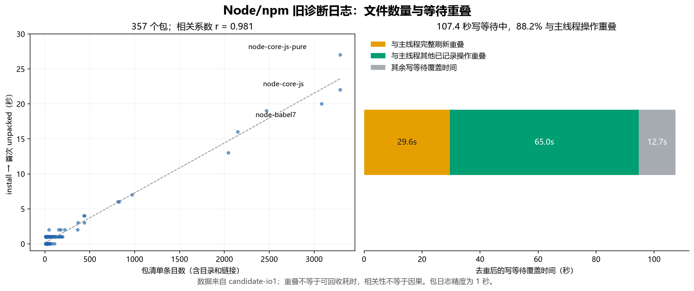

# Node/npm 既有日志深度分析

本轮只读取已保存的日志，没有运行 guest、安装、测速或功能测试，也没有修改运行时代码。所有耗时均属于旧的 `candidate-io1` 诊断版本，不能当作当前源码的性能成绩。

新的主要结论：写等待大多与 dpkg 的文件处理重叠；每次创建进程都会重复模块发现；小文件数量与解包耗时高度相关。此前的完整刷新退化、失败路径重复打开已经有源码修改覆盖，后续应优先检查尚未覆盖的启动、账户查询及虚拟文件系统路径。



## 统计范围与复核

- 安装墙钟时间 **468.685 秒**，357 个包；下载在另一个阶段。
- 全会话原始日志 10,059,240 条，本轮严格按安装时间窗选取 **6,998,039 条**，来自 5,255 个线程文件。
- 重建全部路径汇总：**329,117 个操作/路径/结果组合、1,817,459 条带路径事件**。路径字段也包含 EA 名称，并非全是文件名。
- 旧汇总的 20,000 键限制导致全会话 1,189,680 条带路径事件未进入排行榜；原始记录没有丢失。本轮 SQLite 汇总不截断键。
- 未解析父调用为 0，负的独占耗时为 0；逐项核对 native 操作次数和耗时，重新归属后的总数与原始记录完全相等。
- 按线程文件区分生命周期；不把复用的 Windows PID 当作唯一进程身份。累计耗时、父子耗时和跨进程等待不能直接相加。

复现命令只分析磁盘上的既有文件，输出目录应尚不存在：

```powershell
python tools/analyze-io-trace-deep.py --input artifacts/node-install-20260930/io1 --output artifacts/node-install-20260930/io1-deep-new
python tools/analyze-io-trace-overlap.py --input artifacts/node-install-20260930/io1 --analysis artifacts/node-install-20260930/io1-deep-new
```

本轮结果保存在 `artifacts/node-install-20260930/io1-deep/`：`deep-summary.json`、`paths.sqlite3`、`overlap-summary.json`。第一份报告记录操作归属、路径、启动、包与资源统计；第二份记录时间重叠和失败路径的 native 子操作。

## 1. 108 秒写等待主要是下游处理的伴随现象

按最近的 VFS 父调用归属，`WaitForMultipleObjects` 得到：

| 所属调用 | 等待次数 | 累计等待 |
| --- | ---: | ---: |
| `vfs.write` | 40,027 | 108.390 秒 |
| `vfs.read` | 8,252 | 56.613 秒 |
| 无已记录父调用 | 7,698 | 37.863 秒 |
| 独立 map.read_once、目录读取 | 15,494 | 约 0.012 秒 |

其中，带普通文件元数据访问特征的读、写等待合计仅 **0.051 秒**；其余读写等待约 **164.952 秒**。这里按后代 `map.ea_read/read_once/write_once` 分类，日志没有直接记录 fd 类型，不能仅凭这个分类证明每一个 fd 都是管道。

最集中的形态是 fd 1 上 4,992 次、请求长度 16–64 KiB 的写入，累计等待 **104.616 秒**，返回数据约 161.4 MB；fd 8 上不超过 512 字节的读取累计等待 **46.318 秒**。结合当前 VFS 的 overlapped pipe 实现，这很符合解包进程通过管道向 dpkg 供给数据、dpkg 串行处理文件的模式。

进一步对真实时间区间求并集，排除不同写者之间重复计算后：

| 写等待发生时，主线程在做什么 | 重叠时间 |
| --- | ---: |
| dpkg 主线程的已记录顶层操作 | **94.679 秒，占写等待覆盖时间 88.2%** |
| 其中完整刷新 `FlushFileBuffers` | **29.636 秒** |
| 其中 `sync_file_range` 整个调用 | 31.316 秒，包含上面的刷新，不能再相加 |
| 其中 chmod / rmdir / rename | 分别 8.722 / 8.181 / 7.054 秒 |
| 主线程 fd 8 自己也在等待读取 | 1.152 秒 |
| 全部写等待覆盖的墙钟区间 | **107.394 秒** |

这支持“下游处理文件时，上游受到管道反压”的判断。没有端点关联 ID，时间共现不能证明每次写读的因果配对，但证据已经足够说明：**不能把 108 秒写等待当作独立磁盘瓶颈，也不能把它与 33.6 秒刷新退化相加估算收益。** 减少下游刷新、元数据打开及清理操作，很可能自然缩短上游等待。仅扩大管道缓冲可能转移阻塞位置，不能消除这些工作。

全部等待的累计时间为 202.880 秒，区间并集为 190.229 秒；其中与 fork 区间重叠 15.479 秒。上述并集反映“至少一个线程在等待”的时间，并不代表 CPU 全部空闲。

## 2. 进程启动里存在每次重复的固定成本

安装窗口内的启动记录：

| 阶段 | 次数 | 累计耗时 | 单次中位数 | 单次 P95 |
| --- | ---: | ---: | ---: | ---: |
| `providers-total` | 5,255 | 37.634 秒 | 6.812 ms | 9.509 ms |
| 其中 `providers-discover` | 5,255 | **20.251 秒** | 3.718 ms | 4.943 ms |
| 其中 `providers-bind` | 5,255 | 10.338 秒 | 1.878 ms | 2.669 ms |
| 其中 `providers-shared-load` | 5,255 | 3.483 秒 | 0.637 ms | 0.981 ms |
| `worker-open-runtime` | 5,255 | **23.363 秒** | 4.321 ms | 5.534 ms |

`providers-total` 包含其子阶段；启动还会与父进程 fork 的 ready 等待重叠，不能继续相加。`init-pool-wait` 是覆盖会话生命周期的等待跨度，不列为启动成本。

5,255 次启动与 **3,341 次 fork + 1,914 次 guest-bootstrap** 数量吻合。exec 目标标记中，`dpkg-deb` 714 次，`tar`、`dpkg-split`、`rm` 各 357 次：这四种目标共 **1,785 次，占 1,915 条 exec 请求标记的 93.2%**。请求标记不等同于成功 exec 数，不能强行与 bootstrap 一一对应。

当前 [`ModuleCatalog::discover`](../crates/bridge/src/native.rs) 仍会 canonicalize、枚举与排序目录、读取各模块、解析 PE 导出并建立索引；[`providers::load`](../crates/loader/src/providers.rs) 每次启动调用它。重复的是同一发行目录的结构发现，并不是 guest 程序的数据处理。

**建议优先方向：** 将稳定的模块描述和导出索引做成可验证的发行清单或只读共享描述，保留模块更新检测与每个进程必需的绑定/初始化。默认两个预热 worker 没有消除日志中这 5,255 次发现过程；扩大池也不能直接替代 fork 的状态恢复。

作为背景，全会话 fork 内部分段日志中 ready 累计 30.904 秒、mappings 22.022 秒、create 16.089 秒、arena 3.203 秒；prepare 已包含 create/ready。这组分段有 3,354 次、包括非安装阶段，不能混作安装阶段的精确拆分，也不能直接用“进一步 SIMD 化复制”解释全部 fork 时间。

## 3. 文件数量比数据传输量更能解释这次解包耗时

对 357 个包，使用 dpkg 的 `install` 到**首次** `status unpacked` 时间，再与包 `.list` 条目数比较，Pearson 相关系数为 **0.981**。配置前会再次记录 `unpacked`，不能取最后一次；Windows 文件名中的编码冒号也已还原。

| 包 | 清单条目数 | 解包日志时间 |
| --- | ---: | ---: |
| node-core-js-pure | 3,291 | 27 秒 |
| node-core-js | 3,291 | 22 秒 |
| node-babel7 | 3,084 | 20 秒 |
| node-lodash | 2,470 | 19 秒 |
| node-es-abstract | 2,150 | 16 秒 |
| node-lodash-packages | 2,045 | 13 秒 |

这六个包包含 **16,331 个条目，占全部 30,218 个条目的 54.0%**。线性拟合斜率约为每条目 7.13 ms，只是这组数据的描述，不是可以直接外推的系统常数。

清单包括目录和链接，日志只有 1 秒精度；所有包自己的解包区间累计 273 秒，不能当作完整的约 452 秒 unpack 阶段。相邻包之间还有准备和收尾，同秒开始的包也不能可靠分摊 native 调用。包大小、压缩算法与文件数量未受控，因此相关性并不独立证明因果；结合约 2.82 万次临时文件安装序列，它明确支持优先减少**每个文件的固定操作成本**。

主 dpkg 线程产生 **5,710,521 条事件，占安装记录 81.6%**，承担 68.014 秒完整刷新。Job 累计 CPU 435.125 秒，相对墙钟平均约 0.93 个核，其中内核态占 CPU 的 66.9%。这组证据支持单条安装路径上的重复内核交互是重点；它不能说明整台机器的 CPU 利用率或磁盘硬件是否饱和。

## 4. 失败不是零成本，但已有改动需要扣除

| 操作结果 | 次数 | 整个调用累计时间 |
| --- | ---: | ---: |
| rmdir → ENOENT | 86,991 | 14.021 秒 |
| rename → ENOENT | 28,208 | 4.480 秒 |
| lstat → ENOENT | 28,283 | 3.817 秒 |
| 合计 | 143,482 | **22.318 秒** |

其中 rmdir 的 `.dpkg-tmp` 和 `.dpkg-new` 分别贡献 8.859、4.964 秒；失败 rename 到 `.dpkg-tmp` 是 4.480 秒。失败 rmdir 在主线程上仍执行了 86,991 次 CreateFileW（4.840 秒）和 173,982 次 NtQueryAttributesFile（1.772 秒）；失败 rename 对应 28,208 次 CreateFileW（1.926 秒）和 112,832 次属性查询（1.178 秒）。

已有的[NTFS 不存在结果复用](vfs-ntfs-shared-cache-2026-09-30.md)已经针对 remove/rename 传播单次操作内的 missing 结果。这部分不能再列为“尚未实施”的优化，也没有优化后的测量值。

仍值得审查的是 stat/lstat 对已确认不存在结果的传播：主线程 28,208 次失败 lstat 内，仍有 28,208 次 CreateFileW（1.934 秒）和 56,416 次属性查询（0.867 秒）。当前 `stat_resolution` 的 native 分支把路径交给 `stat_path_resolved` 后打开元数据句柄，可检查是否同样能保留本次解析观察。完整 3.817 秒是整条失败路径的规模，不是可全部省下的时间。

这里应复用**一次操作内**的结果；跨调用缓存 ENOENT 会遇到其他进程创建同名文件、挂载及路径权限变化，不能仅为消除调用而返回旧结果。

## 5. 账户查询：7.59 秒只是已经看见的部分

完整路径表确认 `/etc/passwd` 解析 **30,585 次 / 3.929 秒**，`/etc/group` 解析 **30,578 次 / 3.662 秒**。其中 metadata open 的 4.274 秒包含在 7.591 秒内，不能相加。

当前 [`userdb.rs`](../libs/libc/src/userdb.rs) 的查询会调用 `resolve_linux_path`，随后 `std::fs::read_to_string`，再构造整个账户表，最后查找一个名字或 ID。标准库内部打开/读取及字符串解析不属于这套 VFS 事件的完整覆盖范围，因此 **7.591 秒既不是账户查询总成本，也不是所有读取次数的完整计数**。

可继续做的方向是：单项查询按需解析目标字段，避免构造所有条目；枚举过程在明确的 set/end 生命周期内复用已打开的读取状态。若要跨调用共享数据，必须另行覆盖内容原地修改、原子替换、权限与 namespace 变化。仅使用 mtime 或 TTL 不能从这些日志推出正确性。

## 6. 一个容易漏掉的小热点：不存在的 SELinux 路径

`stat("/sys/fs/selinux")` **409 次，全部 ENOENT，累计 2.262 秒**；中位数 5.356 ms，P95 6.825 ms。其下没有任何已记录的 native 子调用，不能归入 NTFS 打开慢。

当前源码中 [`tmpfs::stat`](../engine/crates/kinakaze-vfs/src/tmpfs.rs) 会取得虚拟卷 snapshot；sysfs snapshot 经 change/refresh 路径重新构造 [`sysfs` 树](../engine/crates/kinakaze-vfs/src/tmpfs/sysfs.rs)。这是“只探测一个不存在的节点，却触发整棵虚拟树刷新”的具体嫌疑。现有日志没有 sysfs 内部跨度，尚不能把 2.262 秒全部精确归属给刷新函数。

建议把静态拓扑、动态属性读取和更新通知分开，在正确的挂载/namespace 内缩小刷新范围；不应直接硬编码这个路径永远不存在。这是低于启动和文件路径优化的后续项。

## 7. 通过验收仍有预配置失败，不能忽略 stderr

会话 stderr 中出现了 **12 次** `Cannot get debconf version`，以及 **12 次** `apt-extracttemplates failed: Inappropriate ioctl for device`。安装日志也有 12 条 `apt-extracttemplates` exec 目标标记。

保存的 rootfs 的 dpkg status 中没有 `debconf`/`apt-utils` 包记录，但 `/etc/apt/apt.conf.d/70debconf` 配置了：

```text
DPkg::Pre-Install-Pkgs {"/usr/sbin/dpkg-preconfigure --apt || true";};
```

因此 Node/npm 安装成功、audit/verify 通过，与预配置钩子报错可以同时发生。当前证据首先指向 rootfs 文件与包数据库/依赖状态需要核对；仅凭输出中的 ENOTTY 文案，不能断言运行时 ioctl 实现有错。应核对 debconf 的文件、版本元数据和依赖是否一致，保留正常钩子语义。

最长一次读取等待为 **4.873 秒**，开始后等待到 EOF，发生在安装早期；相关 PID 的 loader 文件包含 Perl，但 loader 无绝对时间且 PID 可复用，这只能作为关联线索。没有足够证据把整段等待归到上述十二次失败，不能报成确定的可省时间。

## 8. 资源数据能支持的结论

按 PID + birth 区分生命周期后，主 dpkg 进程在 431 次样本中句柄数为 **268–292**，首尾 269→274；private commit 曾升到 73.4 MiB，末尾约 41.1 MiB。没有看到句柄随数万次文件操作线性累积的迹象。

两个长期空闲 worker 句柄数均稳定在 **156**，private commit 约 4.2–4.4 MiB。另一个长期进程从空闲状态转入工作负载，private commit 约 4.3→196.7 MiB；不能把“预热进程激活后持有应用状态”直接判断为泄漏。

每秒采样只看到了 306 个生命周期，远少于 5,255 次创建，短命进程大多未覆盖。以上不是完整无泄漏证明。44,477,501 次 page fault 也没有 hard/soft 分类，不能解释成同等数量的磁盘读取。

诊断本身同样影响结果：安装阶段 `trace.flush` 有 13,842 次、累计 3.614 秒，此外还有时间戳、记录编码、路径构造等未单列成本。关闭日志后的时间不能简单用 468.685−3.614 秒得到。

## 后续优先级

| 优先级 | 方向 | 证据与边界 |
| --- | --- | --- |
| 已改，待后续用户允许验证 | sync_file_range、元数据句柄复用、remove/rename missing 传播 | 历史热点明确；当前没有新成绩 |
| 高 | 进程间复用可验证的模块描述，减少重复发现 | discovery 20.251 秒；会与父进程 ready 等待重叠 |
| 高 | 缩短账户查询及剩余 stat/lstat 路径 | 账户解析已见 7.591 秒；失败 lstat 整条路径 3.817 秒 |
| 中 | 缩小 sysfs 单次观察的刷新范围 | SELinux 不存在探测 2.262 秒；内部归属仍需细分 |
| 中，兼容性 | 核对 debconf 文件、包记录与依赖一致性 | 12 次明确失败；不能靠跳过钩子声称解决 |
| 暂不优先 | 增大管道、继续堆复制 SIMD、EA 常驻缓存 | 写等待多与下游操作重叠；现有证据不足以支持它们是最大剩余收益 |

本轮已核验解析完整性、native 归属守恒和时间区间计算。报告给出的是历史成本及下一步定位方向，没有把重叠耗时相加成提速承诺。
